Debugging is very important in kernel develop, as one thread crash, whole system will down. Also some issue occurance is really small.  
# 1. printk(), pr_*() and dev_*()  
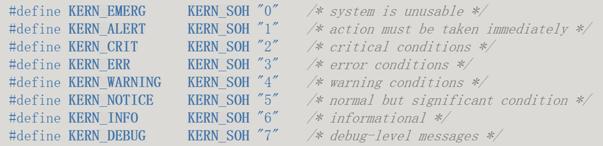  
The printk() function has 8 log levels, ranging from 0 to 7.  
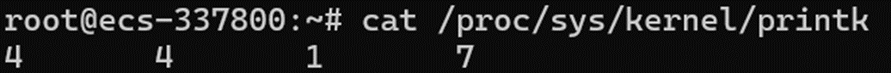  
Output is current, default, minimum and boot-time-default log levels.  
We can use the pr_*() functions as a replacement for printk(). Additionally, by defining pr_fmt(fmt) before any #include statements, we can add a custom format to all pr_*() prints in the file.  
For devices, we can use dev_*() functions, as it will print out device name.  

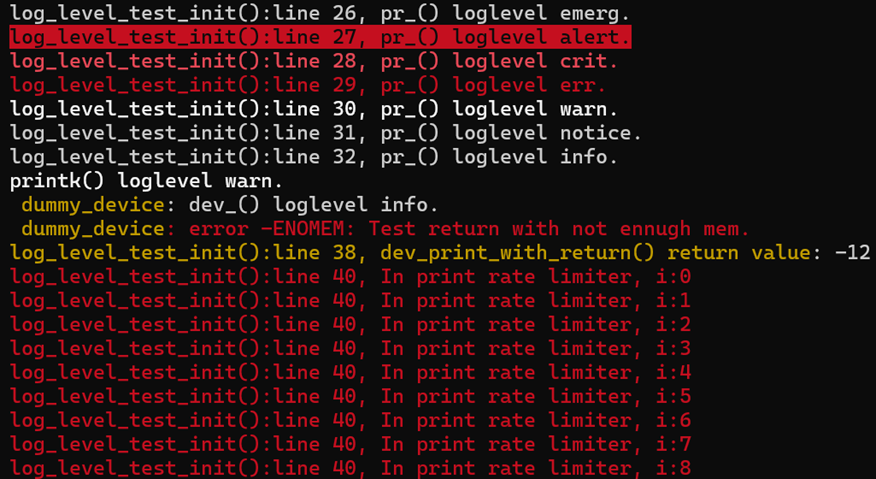  
If some prints might print a lot, we can use printk_ratelimited()/pr_*_ratelimited()/dev_*_ratelimited() to limit the prints.  
If dev returns some error, we can use single API call:  
```c
dev_err_probe(&dummy_device, -NOMEM, "No mem.\n");  
```
to replace with original two lines of code:  
```c
dev_err(&dummy_device, "No mem.\n");  
return –NOMEM;  
```
For pr_dbg()/dev_dbg()/print_hex_dump_debug()/print_hex_dump_bytes(), we can also use dynamic debug to enable those prints. Need enable CONFIG_DYNAMIC_DEBUG option firstly.  
```bash
$ head /sys/kernel/debug/dynamic_debug/control
# filename:lineno [module]function flags format
init/main.c:857 [main]initcall_blacklisted =p "initcall %s blacklisted\012"
init/main.c:818 [main]initcall_blacklist =p "blacklisting initcall %s\012"
init/initramfs.c:477 [initramfs]unpack_to_rootfs =_ "Detected %s compressed data\012"
arch/x86/events/amd/ibs.c:915 [ibs]force_ibs_eilvt_setup =_ "No EILVT entry available\012"
arch/x86/events/amd/ibs.c:886 [ibs]setup_ibs_ctl =_ "No CPU node configured for IBS\012"
arch/x86/events/amd/ibs.c:879 [ibs]setup_ibs_ctl =_ "Failed to setup IBS LVT offset, IBSCTL = 0x%08x\012"
arch/x86/events/intel/pt.c:755 [pt]pt_topa_dump =_ "# entry @%p (%lx sz %u %c%c%c) raw=%16llx\012"
arch/x86/events/intel/pt.c:752 [pt]pt_topa_dump =_ "# table @%p, off %llx size %zx\012"
arch/x86/kernel/tboot.c:85 [tboot]tboot_probe =_ "tboot_size: 0x%x\012"
```
Most commonly used keywords are func, file, line, module, flags. For example:  
```bash
echo 'file svcsock.c line 1603 +pmf' > /sys/kernel/debug/dynamic_debug/control
echo 'module test* +p' > /sys/kernel/debug/dynamic_debug/control
```
The flags are:  
```bash
-    remove the given flags
+    add the given flags
=    set the flags to the given flags

    p    enables the pr_debug() callsite.
    _    enables no flags.

        Decorator flags add to the message-prefix, in order:
            t    Include thread ID, or <intr>
            m    Include module name
            f    Include the function name
            s    Include the source file name
            l    Include line number
```

# 2. BUG_ON(), WARN_ON_ONCE(), dump_stack()  
BUG_ON(condition); Will call BUG(), and panic().  
WARN_ON(condition); Will print call stack, but won’t panic().  
WARN_ON_ONCE(condition); Will only print once.  
We can add WARN_ON_ONCE(1) in the code we are interested in, so we can know how this function is called.  
dump_stack(); Only print kernel stack and some of the registers.  
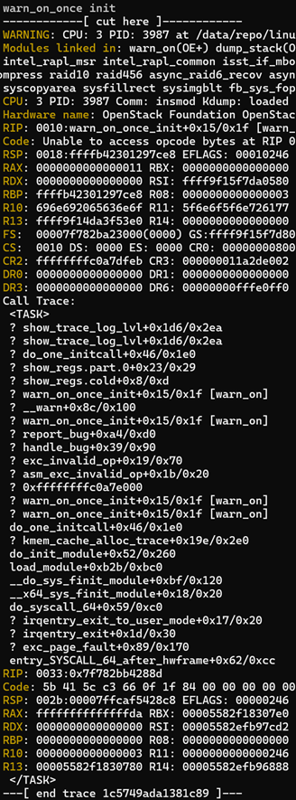
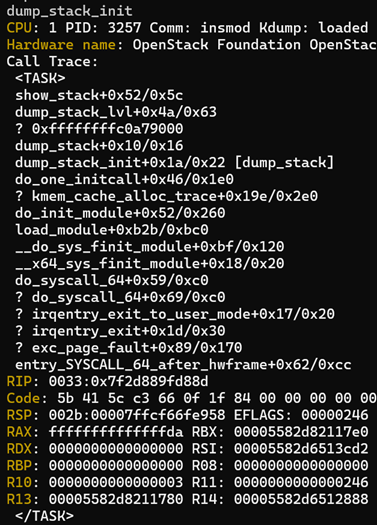  
We can see that WARN_ON() output is more than dump_stack().  

# 3. strace  
Strace can be used to determine which system calls are being invoked by a process, this is important in some cases.  
-T, --syscall-times[=precision]. Show  the  time spent in system calls.  
-tt, --absolute-timestamps=precision:us. Know which system calls are used.  
-ff, --follow-forks and --output-separately. Trace  child  processes and each processes trace is written to filename.pid.  
-p $pid, trace this $pid.  
-o outputfile, will output to this file.  
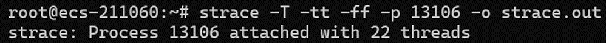  
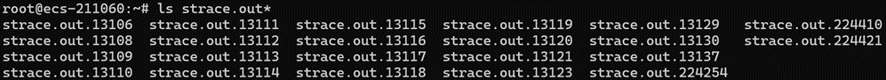  
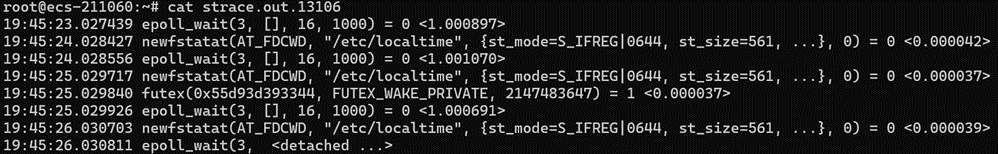  
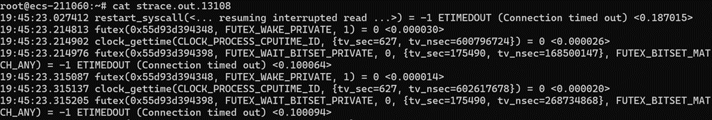  

# 4. procfs  
## sched  
Check scheduler details:  
```bash
$ cat /proc/$pid/sched
```
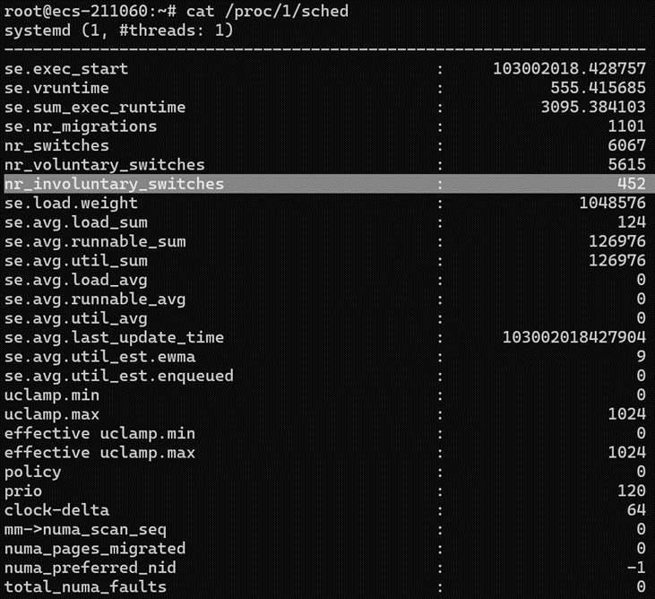  
## irq  
Check hardirq, softirq and ethernet usage:  
```bash
$ cat /proc/interrupts
$ cat /proc/softirqs
$ cat /proc/net/*
```
affinity_hint: 0 - No specific interrupt affinity core suggested.  
effective_affinity: 8 - Current effective affinity core is core 3.  
effective_affinity_list: 3 - Current core is core 3.  
node: 0 - Running on NUMA node 0.  
smp_affinity: f - Cores 0-3 can run.  
smp_affinity_list: 0-3 - Cores 0-3 can run.  
spurious:count 30464 - Spurious interrupts due to misconfiguration or hardware faults.  
spurious:unhandled 1 - One unhandled interrupt.  
spurious:last_unhandled 44560640 ms - Last spurious interrupt occurred 44560640 ms after boot.  
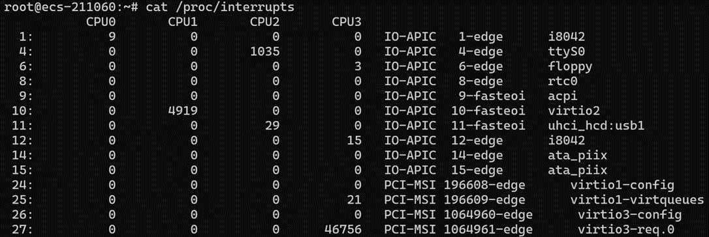  
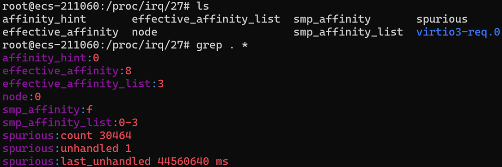  
## memory  
For memory checking, we can firstly use free command to check overall usage, and if need further details, we can check meminfo, buddyinfo, slabinfo, vmallocinfo and other statistics in procfs.  
Details can check: The /proc Filesystem — [The Linux Kernel documentation](https://www.kernel.org/doc/html/latest/filesystems/proc.html?highlight=meminfo)  
We can also add our custom debug file to proc file system, via proc_create() and add related file_operations.  

# 5. ftrace  
There are many tools for kernel debug, like lttng, stap, perf, ebpf. Ftrace and ebpf is most commonly used.  
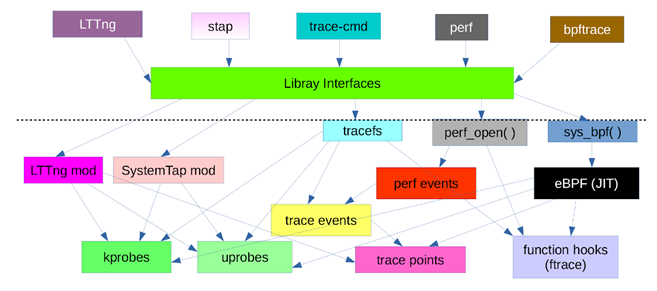  
Ftrace has many available tracers.  
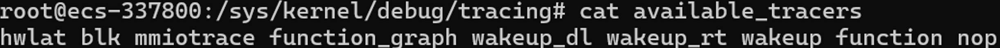  
## function trace  
```bash
$ sysctl kernel.ftrace_enabled=1
$ echo function > /sys/kernel/debug/tracing/current_tracer
$ echo 1 > /sys/kernel/debug/tracing/tracing_on
$ cat /sys/kernel/debug/tracing/trace_pipe
```
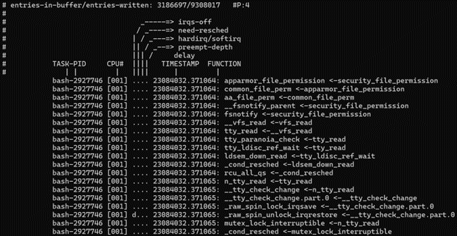  
After enable function trace for all functions, there will be many output.  
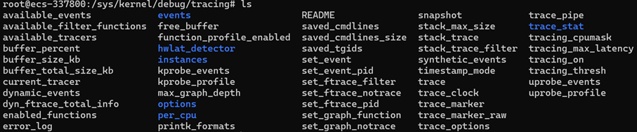  
Commonly used files:  
```bash
1. tracing_on: controls ring buffer, note that set to 0, ftrace is still running.
2. current_tracer: current used tracer.
3. trace: human readable format output.
4. trace_options: can add stack trace, timestamps.
5. tracing_cpumask: mask those CPUs need to be traced.
6. trace_marker: Write string to file will output into the ftrace buffer.
7. trace_clock: global(sync with all cores), local(don’t sync with other cores).
8. trace_pipe: continuously output trace.
```
### filter sched* functions  
```bash
$ echo nop > current_tracer
$ echo 0 > tracing_on
$ echo global > trace_clock
$ echo 'sched*' > ./set_ftrace_filter
$ echo function > current_tracer
$ echo 1 > tracing_on
```
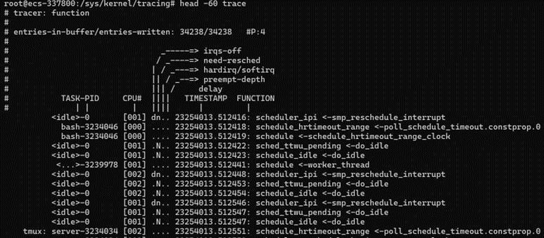  
### trace_on/off/print stack  
```bash
$ echo nop > current_tracer
$ echo 0 > tracing_on
$ echo 'schedule:traceon:1' >> ./set_ftrace_filter
$ echo 'schedule_idle:traceoff:1' >> ./set_ftrace_filter
$ echo 'schedule_idle:stacktrace:1' >> ./set_ftrace_filter
$ echo function > current_tracer
$ echo 1 > tracing_on
```
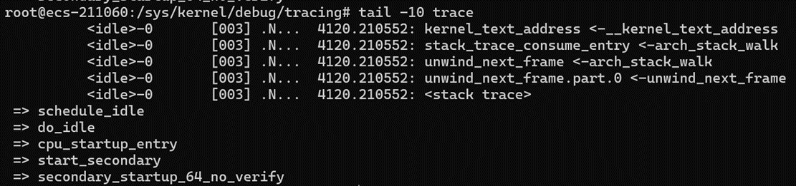  

## function graph trace  
```bash
$ echo nop > current_tracer
$ echo 0 > tracing_on
$ echo function_graph > ./current_tracer
$ echo 1 > ./options/funcgraph-proc
$ echo 1 > ./options/funcgraph-tail
$ echo do_open > ./set_graph_function
$ echo 1 > options/latency-format
$ echo 1 > tracing_on
$ sleep 1
$ echo 0 > tracing_on
```
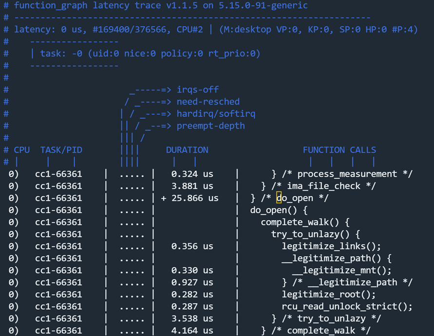  

We can reset ftrace to initial state via:
https://github.com/brendangregg/perf-tools/blob/master/tools/reset-ftrace  
## event trace  
```bash
$ echo nop > current_tracer
$ echo 0 > tracing_on
$ grep sched: available_events
$ echo sched:* > set_event
$ echo 1 > tracing_on
$ sleep 1
$ echo 0 > tracing_on
```
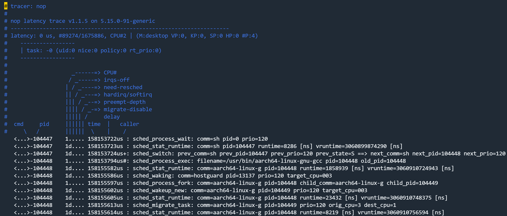
### argument as filter
```bash
$ echo nop > current_tracer
$ echo 0 > tracing_on
# ~ means substring match.
$ echo 'prev_comm~"*sh*"' >> events/sched/sched_switch/filter
$ echo 1 > events/sched/sched_switch/enable
$ echo 1 > tracing_on
# Disable：
$ echo 0 > events/sched/sched_switch/enable
$ echo 0 > events/sched/sched_switch/filter
```
Parameter can refer to events/sched/sched_switch/format file.  
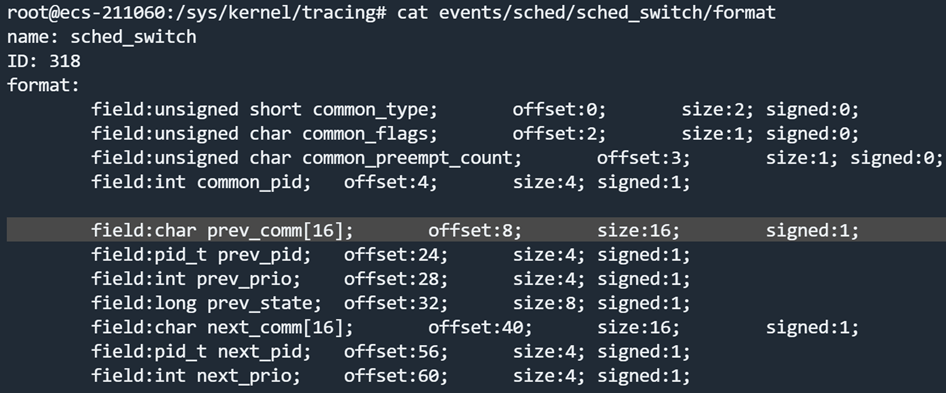  
Output looks like:   
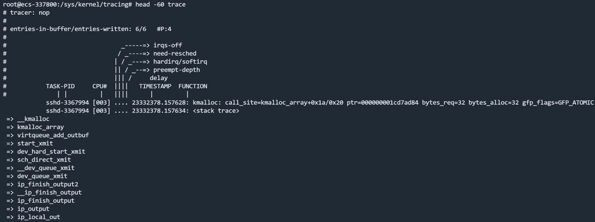  

## kprobe  
```bash
$ echo 0 > tracing_on
$ grep __tasklet_schedule /proc/kallsyms
$ echo 'p:my_tasklet_schedule __tasklet_schedule state=+0x8($arg1):u64' >> kprobe_events
$ cat kprobe_events
$ echo 1 > events/kprobes/my_tasklet_schedule/enable
$ echo 1 > tracing_on
# Disable:
$ echo 0 > events/kprobes/my_tasklet_schedule/enable
$ echo '-:my_tasklet_schedule’ > kprobe_events
```
We can print according to function name and parameters, also we can print the value which has some offset to function parameter.  
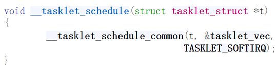  
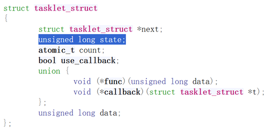  
output is:  
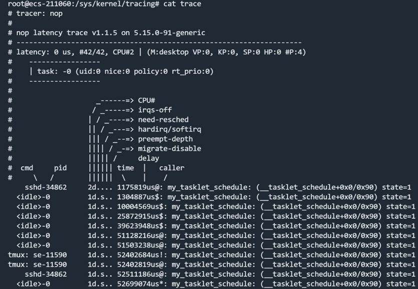  
### kretprobe  
```bash
$ echo 'r:my_open do_sys_open ret=$retval' > kprobe_events
```

## ftrace filters  
When enable ftrace, there will be many output, we need to use filters to get what we need.  
| Filters                                      |                                                                                       |
| -------------------------------------------- | ------------------------------------------------------------------------------------- |
| tracing_cpu_mask                             | Mask 21 will only trace core 0 and 5.                                                 |
| set_ftrace_pid/set_event_pid                 | Only trace/not trace this pid.                                                        |
| set_ftrace_notrace_pid/set_event_notrace_pid |                                                                                       |
| set_ftrace_filter/set_ftrace_notrace         | Only trace/not trace this function in function trace. See available_filter_functions. |
| set_graph_function/set_graph_notrace         | Only trace/not trace this function in function graph trace.                           |
| set_event                                    | Only trace this function in event trace. See available_events                         |
| events/*/filter                              | Allows set up filters for specific trace events. i.e. 'prev_comm~""*sh*""'            |
| events/*/trigger                             | Allows set up filters for trigger. i.e. 'stacktrace if bytes_req<=1024'               |
Kprobe events are same as normal events, can use similar filters.  

# 6. perf tool  
perf tool is very useful for performance optimization.  
## perf top  
Simply see the top functions in that core or process.  
```bash
# check whole system
$ perf top
# only check this core
$ perf top -C 1
# only check this pid
$ perf top -p $pid
# only check this tid
$ perf top -t $tid
```
We can always check perf help command with -h.  
```bash
# check help with -h
$ perf $command -h
```
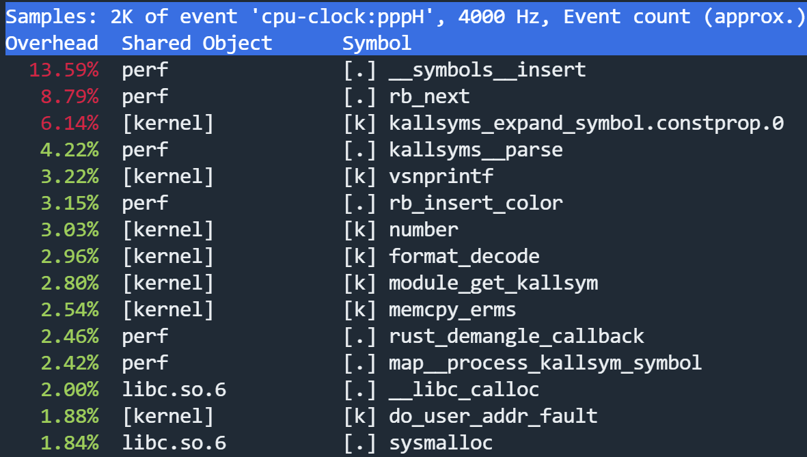  
## perf stat  
We can use "perf stat" to see which function called most times.  
  
## perf record & report  
```bash
# -e means event, cycles:k means kernel, :u means user space.
$ perf record -e cycles:k -C 0
$ perf record -e cycles:u -C 0
# record "-F max" means use max frequency perf tool supports.
# This command only records for test_command.
$ perf record -F max -- $test_command
# check reports.
$ perf report
```
## perf trace  
For example, we can trace page fault easily via perf trace.  
```bash
# trace "-F all" means all pagefaults, including major and minor.
$ perf trace -F all -C 0-3
```
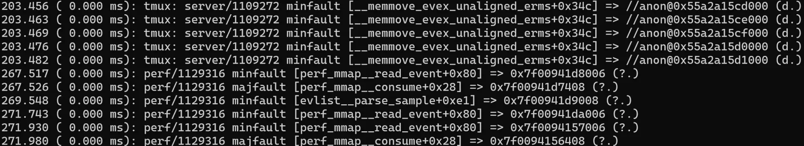  
```bash
# trace schedule events
$ perf trace -e sched:*
```
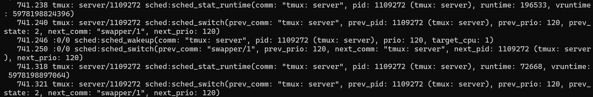    
It is similar as ftrace's event trace.  
## perf probe  
We can dynamically add probe for perf, and use perf trace to see related events.  
Trace kernel function:  
```bash
$ perf probe -V tcp_sendmsg  
$ perf probe --add 'tcp_sendmsg size'
$ perf record -e probe:tcp_sendmsg -aR sleep 1
$ perf script
# Or directly use
$ perf trace -e probe:tcp_sendmsg -aR
```
Trace user function:  
```
$ perf probe -x /usr/lib/x86_64-linux-gnu/libc.so.6 --add malloc
$ perf probe -x /usr/lib/x86_64-linux-gnu/libc.so.6 --add free
$ perf record -e probe_libc:malloc -e probe_libc:free
$ perf report -n
$ perf script
```
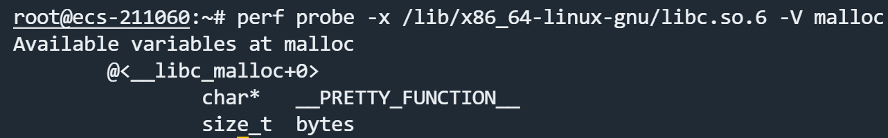  
Output will be like:  
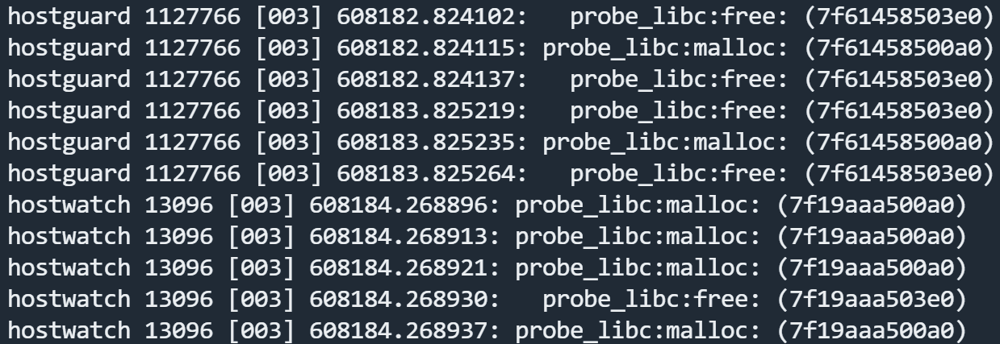  
We can also use our custom libraries, and trace functions we implemented with similar command.  

## perf PMU counters  
Performance Monitoring Unit (PMU) counters are hardware registers which count specific types of micro-architectural events.  
```bash
$ perf stat -e r052/name=L2_miss/u -e r037/name=LLC_miss/u -e r066/name=Memory_read/u pstree
```
Here /u means only trace user space, we can also use /k to indicate trace kernel space. r052 is raw PMU events.  
Output:  
```bash
 Performance counter stats for 'pstree':

             32403      L2_miss                                                            
              3936      LLC_miss                                                           
           8625472      Memory_read                                                        

       0.052379820 seconds time elapsed

       0.018325000 seconds user
       0.032193000 seconds sys
```

## perf flamegraph  
Firstly download tools from repo: https://github.com/brendangregg/FlameGraph.git  
```bash
# Clone repo
$ git clone git@github.com:brendangregg/FlameGraph.git
# In target env
$ perf record -F max --call-graph dwarf -a -g
$ perf script > out.perf
# In host env
$ ./FlameGraph/stackcollapse-perf.pl out.perf > out.perf-folded
$ ./FlameGraph/flamegraph.pl out.perf-folded > flamegraph-example.svg
```
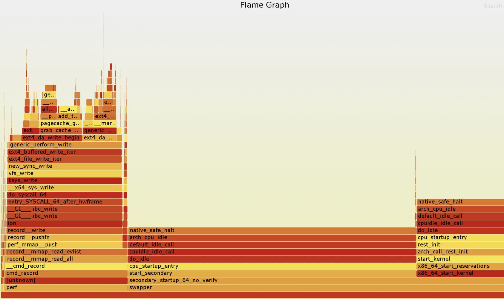  
The Y-axis represents the call stack, with the upper positions indicating the most recently called functions.  
The X-axis shows the sampling count; the wider a section, the more time it has consumed.  
If there are plateaus (flat tops), it indicates a bottleneck.  

# 7. ARM specific  
## coresight  
CoreSight is a hardware-based debug and trace technology in ARM processors that allows for detailed tracing of program execution.  
Enable those flags in kernel:  
```bash
CONFIG_CORESIGHT=y
CONFIG_CORESIGHT_LINKS_AND_SINKS=y
CONFIG_CORESIGHT_SOURCE_ETM4X=y
CONFIG_CORESIGHT_TMC=y
CONFIG_CORESIGHT_TPIU=y
CONFIG_CORESIGHT_SINK_TMC=y
CONFIG_CORESIGHT_SINK_ETB=y
CONFIG_CORESIGHT_SINK_ETF=y
CONFIG_CORESIGHT_SINK_SF=y
CONFIG_CORESIGHT_CATU=y
```
modprobe needed kernel modules, then capture via perf tool.  
```bash
$ perf record -e cs_etm/cycacc,timestamp,@tmc_etr0/ -p 1 -- sleep 10
$ perf script -i perf.data --ns --header -F +comm,+pid,+tid,+cpu,+time,+ip,+sym,+dso,+addr,+symoff,+flags,+callindent
```
cs_etm: Stands for CoreSight Embedded Trace Macrocell, a component of ARM's CoreSight technology used for program flow tracing.  
cycacc: A configuration option that enables cycle accurate tracing. This means the trace will include precise timing information about each instruction.  
timestamp: A configuration option that includes timestamps in the trace data.  
@tmc_etr0: Specifies the sink for the trace data. tmc_etr0 refers to a Trace Memory Controller (TMC) in Embedded Trace Router (ETR) mode, which is a CoreSight component responsible for collecting and storing trace data.  
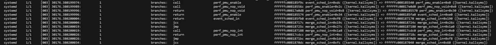
It is useful for analyzing performance data with high precision and understanding the sequence of function calls and events that occurred during the execution of a program.  
We can also use coresight perf instruction tracing, which provides detailed information about the execution path of a program. This can be useful for identifying performance bottlenecks and understanding the behavior of applications at a very fine granularity.  
## SPE (Statistical Profiling Etension)  
SPE offers HW level of event tracing, which is similar as Intel PEBS and AMD IBS.  
It need enable ARM_SPE_PMU config.  
https://perf.wiki.kernel.org/index.php/Latest_Manual_Page_of_perf-arm-spe.1  
Arm recommends that the minimum sampling interval is once per 1024 micro-operations. This value is communicated to software through PMSIDR_EL1.Interval, bits[11:8].  
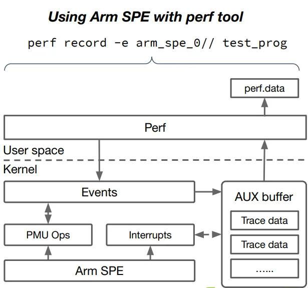
ARM SPE is supported in 5.14 kernel.  
Memory events are not supported by ARM cores, so we need ARM SPE for memory profiling on ARM platforms.  
```bash
$ perf record -d -e arm_spe_0/ts_enable=1,load_filter=1,store_filter=0,min_latency=400/ ls
$ perf report --mem-mode
```
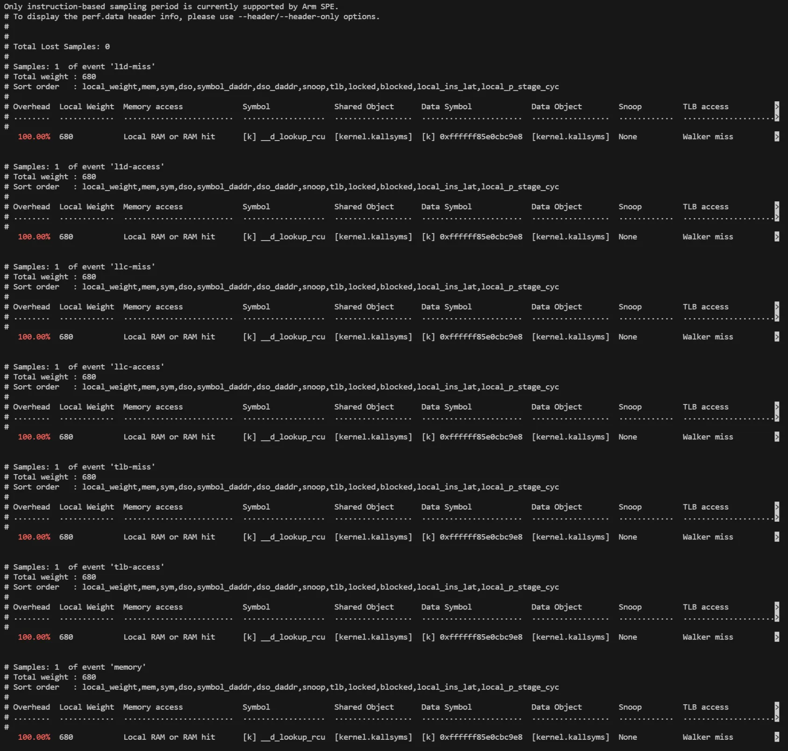  
### Check branch miss  
```bash
$ perf record -e arm_spe/branch_filter=1/ -c 1000 ls
```
branch miss info：  
  

### Check high latency events  
Lower than min_latency events will be discarded.  
Only record when exceed 600 clock cycles. Every 1000 samples will take one.  
```bash
$ perf record -e arm_spe/min_latency=600/ -c 1000 ls
$ perf report --mem-mode
```
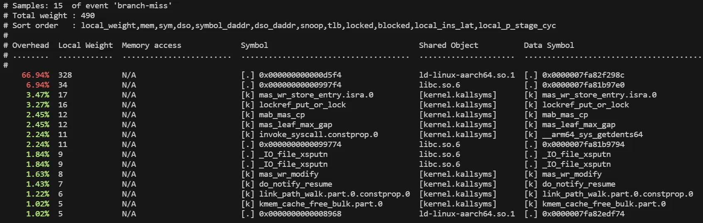  

# 8. oops debug  
Take example from kernel Bugzilla: 217198 – ath11k: kernel panics on rmmod: https://bugzilla.kernel.org/show_bug.cgi?id=217198  
pc (program counter): function name + offset/length.  
lr(link register): function name + offset/length.  
sp: stack pointer.  
X0-x29: aarch64 registers.  
CPU:9, PID: 1181, comm: rmmod, Not tainted, kernel version 5.15.5, git hash is g96f75039abe2.  
Call trace: stack trace of that CPU.  
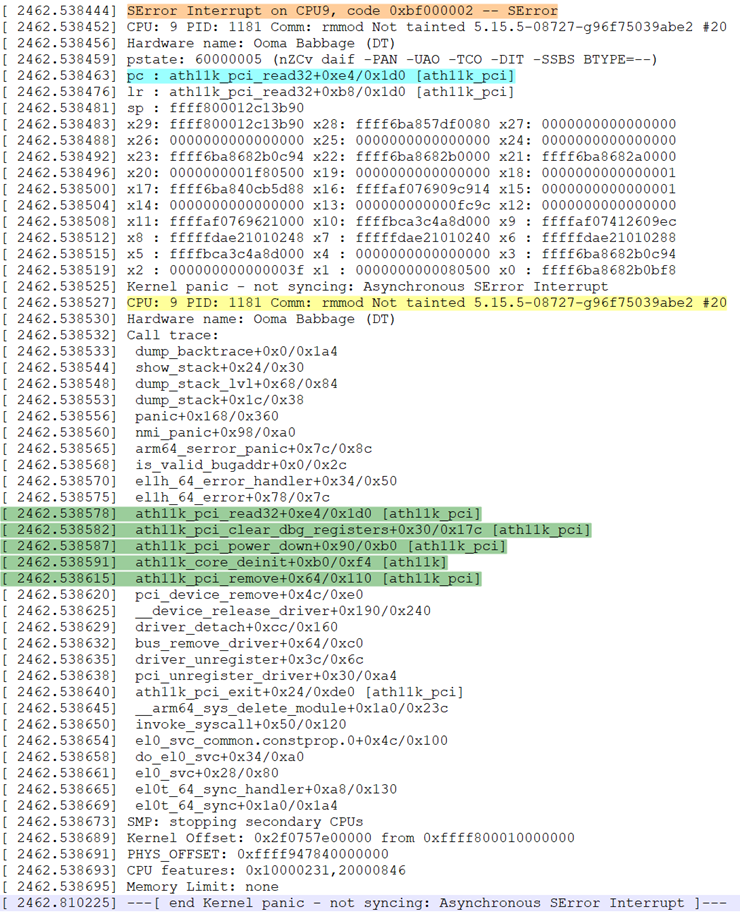  

## crash, gdb, objdump and addr2line
We can use crash, objdump, gdb, and addr2line to parse:  
```bash
$ crash vmlinux /var/crash/$TIMESTAMP/dump.$TIMESTAMP  
# Check backtrace.  
crash> foreach bt  
crash> bt  
PID: 509    TASK: ffff000006a5ea00  CPU: 0   COMMAND: "bash"  
 #0 [ffff0000069ff760] crash_setup_regs at ffff8000102217b0  
 #1 [ffff0000069ff790] __crash_kexec at ffff80001022387c  
 #2 [ffff0000069ff910] panic at ffff800010078fe4  
 #3 [ffff0000069ffa40] sysrq_handle_crash at ffff800010b40034  
 #4 [ffff0000069ffa60] __handle_sysrq at ffff800010b40870  
 #5 [ffff0000069ffaa0] write_sysrq_trigger at ffff800010b418c8
# slabinfo  
crash> kmem -S  
# Slab mem leak info, including leak source.  
crash> kmem -i  
# Slab idle and active objects.  
crash> kmem -o  
crash> runq  
CPU 0 RUNQUEUE: ffff00003fd77940  
  CURRENT: PID: 509    TASK: ffff000006a5ea00  COMMAND: "bash"  
  RT PRIO_ARRAY: ffff00003fd77b80  
     [no tasks queued]  
  CFS RB_ROOT: ffff00003fd779f0  
     [no tasks queued]
# list traverse  
crash> list -s rwsem_waiter.task,type -h $addr  
```  
Check value in struct fields.  
```bash  
crash> struct task_struct.comm,pid,mm,parent,real_parent ffff000006a5ea00 -x  
  comm = "bash\000\000\000)\000\000\000\000\000\000\000",  
  pid = 0x1fd,  
  mm = 0xffff000002857840,  
  parent = 0xffff000002780000,  
  real_parent = 0xffff000002780000,  
crash>   
# task_struct addr will be printed in ps command  
crash> ps | grep systemd                                                      
[ 7358.357537] hrtimer: interrupt took 13919589 ns  
      1      0   1  ffff000001eaea00  IN   0.0  165216   9376  systemd  
    124      1   2  ffff0000024c0d40  IN   0.0   21636   6172  systemd-journal  
    139      1   1  ffff000001f9a7c0  IN   0.0   17896   4412  systemd-udevd  
    286      1   0  ffff000005ec8d40  IN   0.0   15012   6364  systemd-logind  
    476      1   3  ffff000004438000  IN   0.0   16764   8228  systemd  
    477      1   0  ffff000004438d40  IN   0.0   88896   6312  systemd-timesyn  
crash> struct task_struct.mm ffff000001eaea00 -x  
  mm = 0xffff000003f803c0,  
# We can see owner field points to task_struct addr  
crash> struct mm_struct.owner 0xffff000003f803c0 -x  
    owner = 0xffff000001eaea00,
```  
```bash
$ objdump -dSl vmlinux.elf > output.log
```
-d, --disassemble show disassemble code.  
-S, --source indicates including source code.  
-l, --line-numbers represents file and line numbers.  
Another way is we can use "gdb vmlinux.elf" and call "x/20i *schedule+offset" command to decode it.
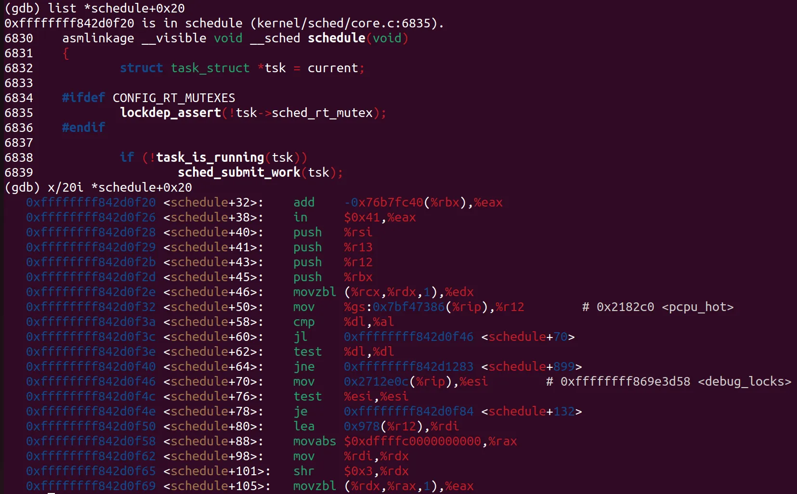
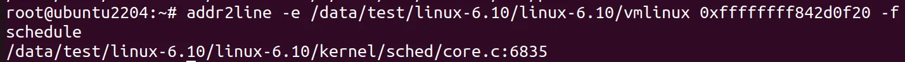
If we don’t have vmlinux.elf, we can generate it via:  
```bash
$ vmlinux-to-elf vmlinux vmlinux.elf
```
[marin-m/vmlinux-to-elf: A tool to recover a fully analyzable .ELF from a raw kernel, through extracting the kernel symbol table (kallsyms) (github.com)](https://github.com/marin-m/vmlinux-to-elf)  
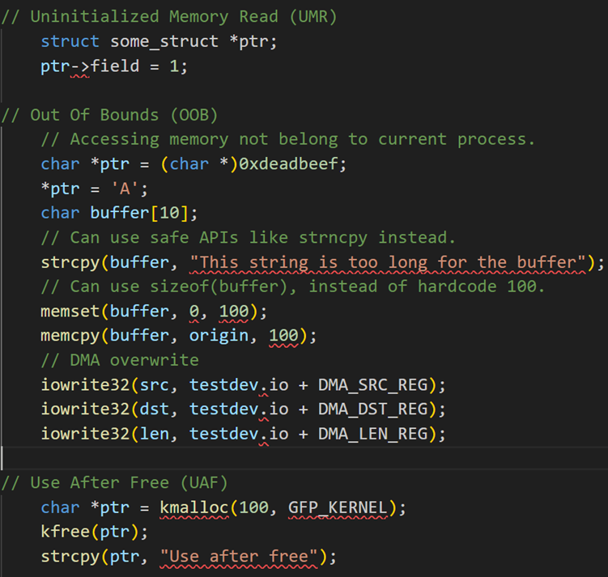  
We can also use script decode_stacktrace.sh in linux kernel repo, to parse it.  
Before:  
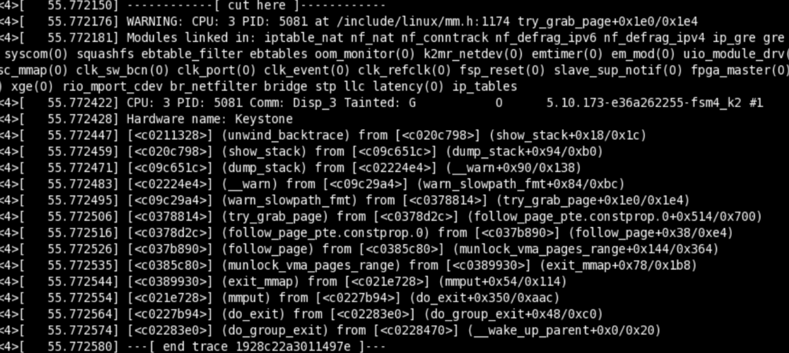  
After:  
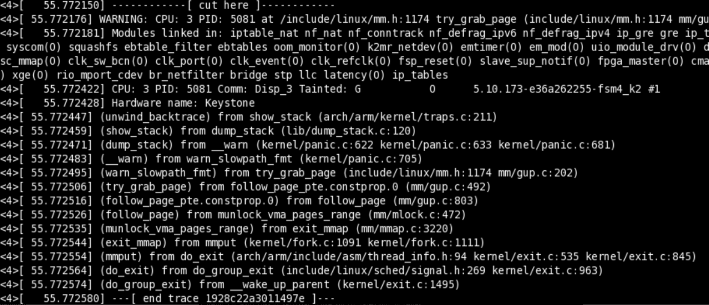  
We can see that file and line is added.  
## oops common reasons  
Usually oops is caused by invalid memory access. For example:
1. Uninitialized Memory Read  
2. Out Of Bounds  
3. Use After Free  

## Slub debug  
To enable slub debug, set slub_debug in /proc/cmdline or CONFIG_SLUB_DEBUG_ON.  
i.e. slub_debug=F,dentry  
Short users guide for SLUB — https://www.kernel.org/doc/html/v4.18/vm/slub.html  
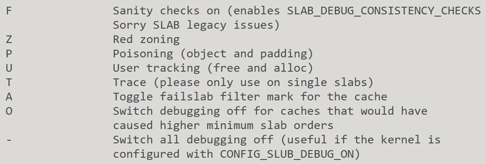  

## Other debug flags  
1. DATA corruption  
Enable CONFIG_BUG_ON_DATA_CORRUPTION, kernel will report BUG() when it encounters data corruption.  
2. Debug page alloc  
Enable CONFIG_DEBUG_PAGE_ALLOC, kernel will unmap pages from the kernel linear mapping after free_pages().  
3. DMA debugging  
Enable CONFIG_DMA_API_DEBUG, kernel will be able to detect common bugs in device drivers like double-freeing of DMA mappings or freeing mappings that were never allocated.  

# 9. hang debug  
The simple way check top command.  
[top(1) - Linux manual page (man7.org)](https://man7.org/linux/man-pages/man1/top.1.html)  
Can check man top, mostly with:  
us: user process running time.  
sy: kernel process running time.  
wa: io-wait time, if it is high, means io do has some pb. But when it is low, io might also have some pb.  
hi: hardware interrupt handling time.  
si: software interrupt handling time.  

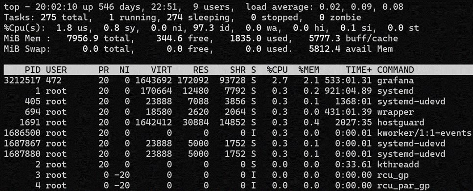  
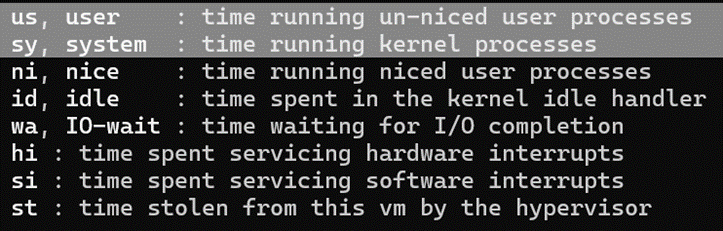  
System hang could be caused by dead lock or RT/FIFO scheduling class run for long time.  
## atomic sleep  
[215809 – [aarch64] BUG: sleeping function called from invalid context at kernel/locking/mutex.c:577](https://bugzilla.kernel.org/show_bug.cgi?id=215809)  
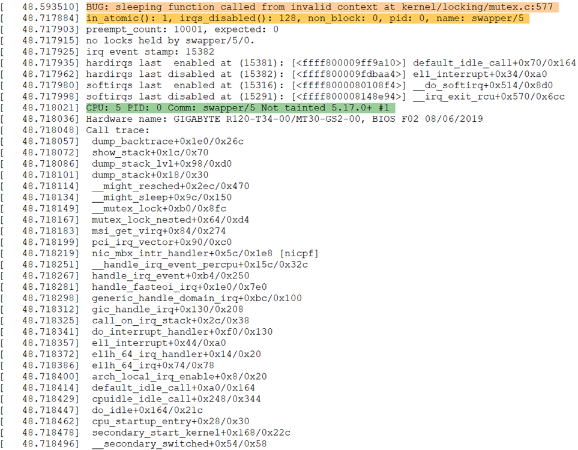  

## lock related issues  
Can also open CONFIG_LOCKDEP, or CONFIG_KCSAN to check details.  
[215389 – pagealloc: memory corruption with VMAP_STACK=y set and burdening the memory subsystem via "stress -c 2 --vm 2 --vm-bytes 896M" (kernel.org)](https://bugzilla.kernel.org/show_bug.cgi?id=215389)  
BUG indicate there is data-race in __hrtimer_run_queues / hrtimer_active.  
There is read on CPU 1 and write on CPU 0.  
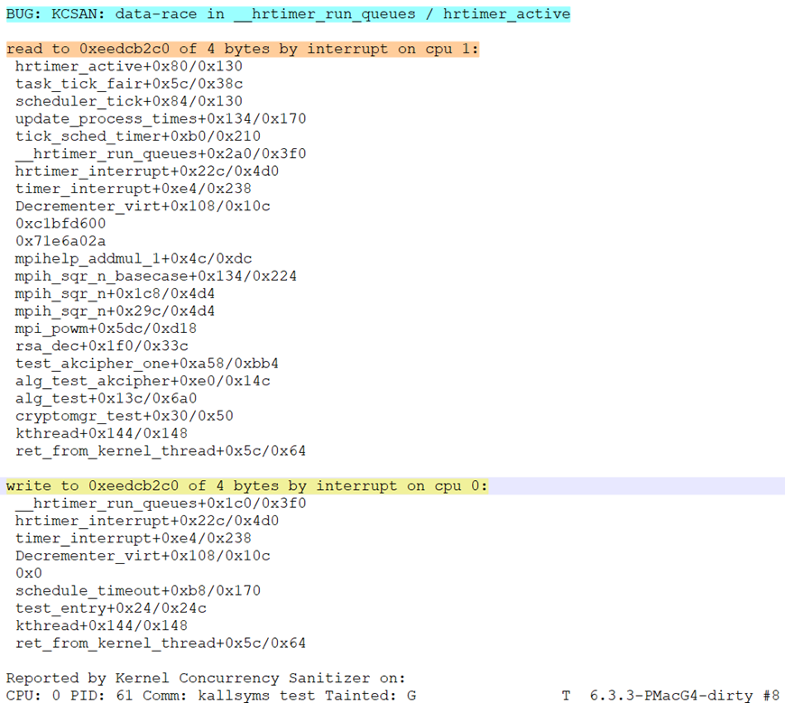  
After enable lock stat, we can also check each lock's details.  
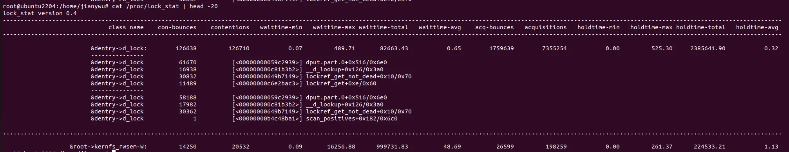  

## irqsoff tracer  
Can enable irqsoff tracer via:  
```bash
$ echo irqsoff > current_tracer
```
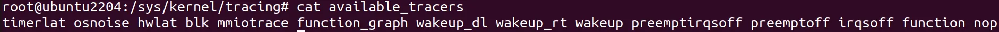  
We can see the details, in this case, it is hardirq, we can see what functions are calling there, caused hang.  
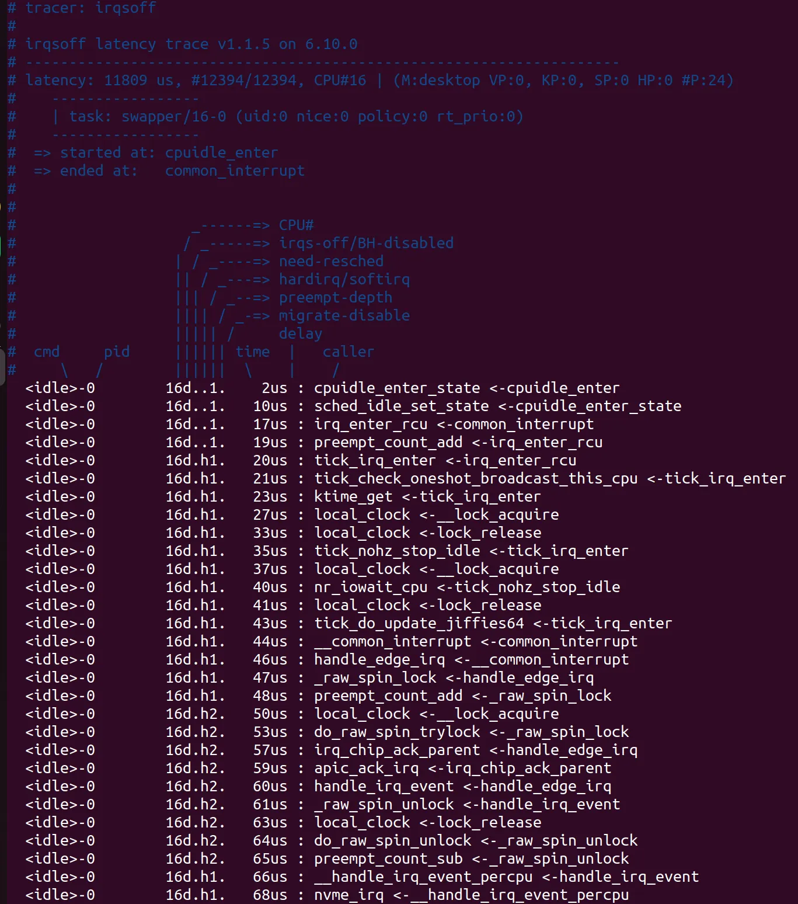  
Similarly we can also enable preemptoff tracer, or preemptirqoff tracer, to see what happens.  
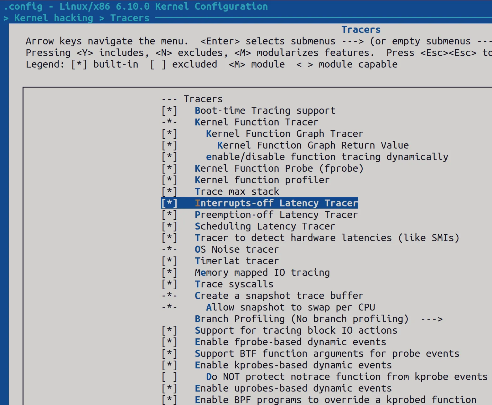  

# 10. Sanitizers
## KASAN  
KASAN (Kernel Address Sanitizer)  
To enable KASAN, configure the kernel with: CONFIG_KASAN=y, and choose CONFIG_KASAN_HW_TAGS. It is the mode intended to be used as an in-field memory bug detector or as a security mitigation. This mode only works on arm64 CPUs that support MTE (Memory Tagging Extension), as it has low memory and performance overheads, it can be used in production.  
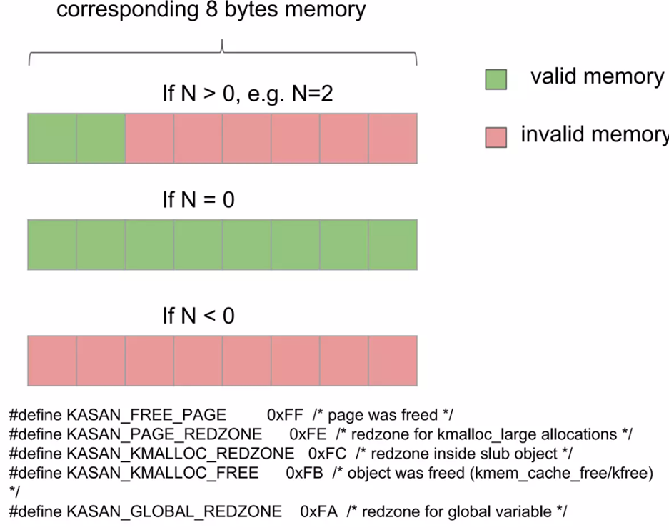  
Sample log:  
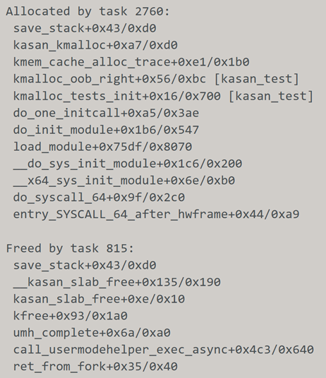  
ARM64 also has HW-Tag Based KASAN, it has lower overhead, and requires the Memory Tagging Extension (MTE).  

## KFENCE
Kernel Electric-Fence is a low-overhead sampling-based memory safety error detector.  
Note that kfence designed to be enabled in production kernels, and has near zero performance overhead.  
Enable via:  
```bash
CONFIG_KFENCE=y
```
Sample log:  
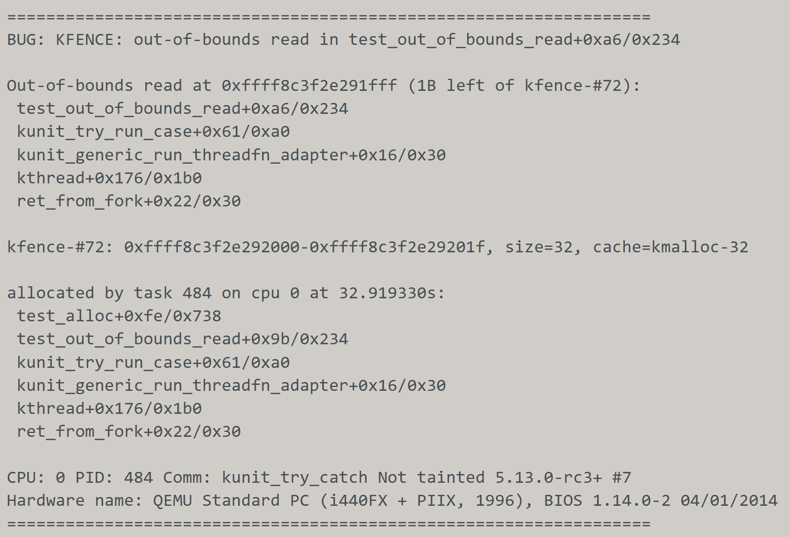  

## KCSAN  
Kernel Concurrency Sanitizer is a dynamic race detector, uses a watchpoint-based sampling approach to detect race conditions.  
Enable via:  
```bash
CONFIG_KCSAN = y
```
Sample log:  
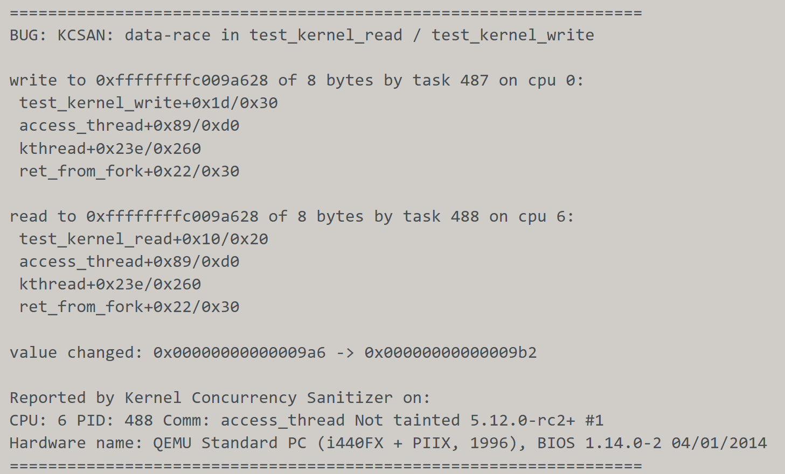  

## KMSAN  
Kernel Memory Sanitizer aimed at finding uses of uninitialilzed values.  
Build need clang tool and enable configs.  
```bash
CONFIG_KMSAN = y
CONFIG_KCOV = y
```
Sample log:  
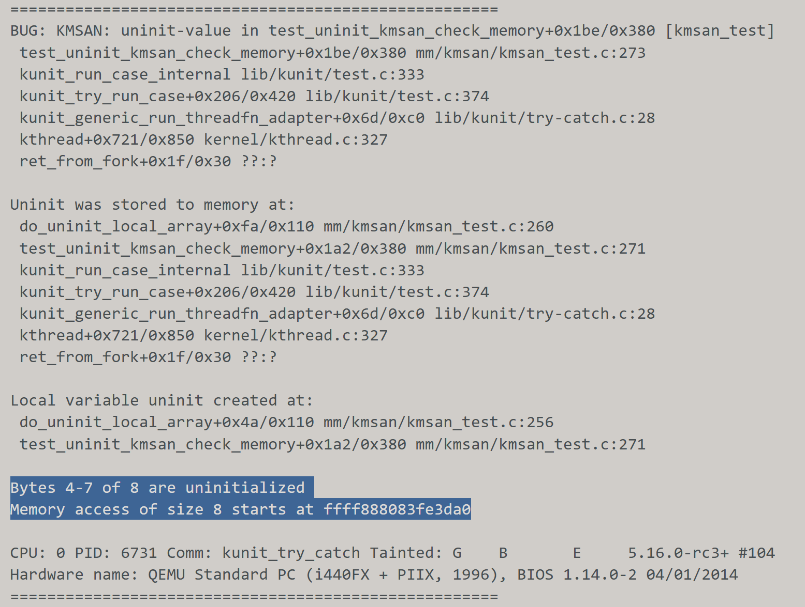  

## UBSAN
UBSAN uses compile-time instrumentation to catch undefined behavior.  
Enable via:  
```bash
CONFIG_UBSAN=y
```
Sample log:  
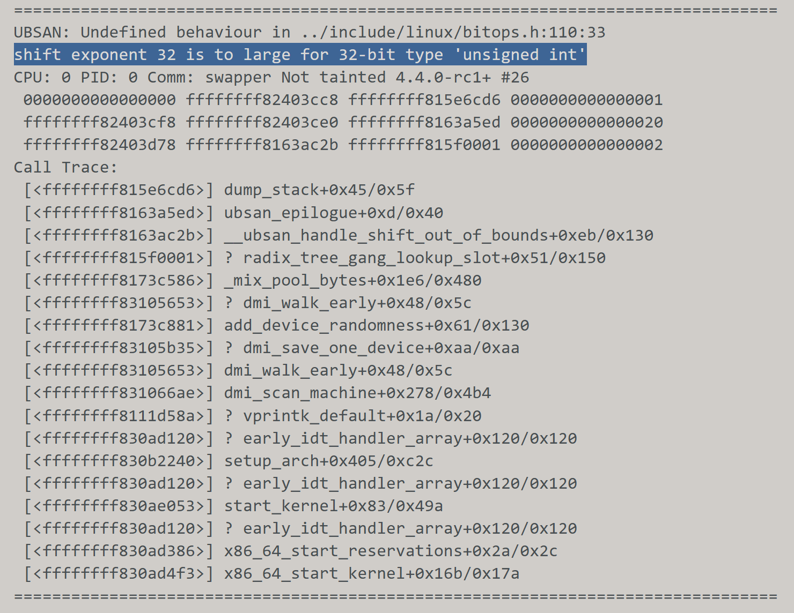
We also have other sanitizers like KTSAN, details can see: https://github.com/google/kernel-sanitizers  

# 11. security related  
Linux kernel defence map has many debug methods for security issues.  
https://github.com/a13xp0p0v/linux-kernel-defence-map/blob/master/linux-kernel-defence-map.svg  
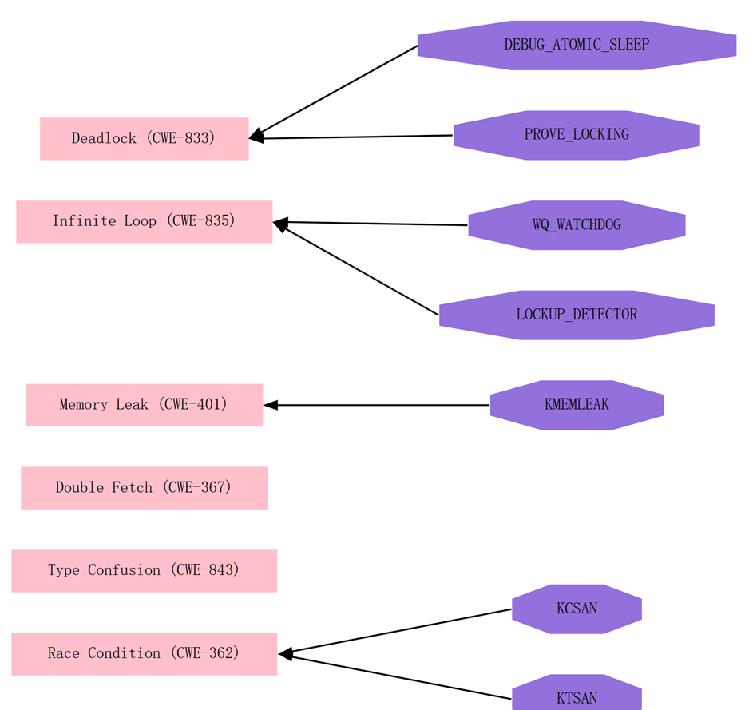  

# 11. References  
Linux Kernel Debugging -- https://github.com/PacktPublishing/Linux-Kernel-Debugging  
https://www.kernel.org/doc/html/latest/dev-tools/kasan.html  
https://linux-kernel-labs.github.io/refs/heads/master/lectures/debugging-slides.html#27.  
https://developer.arm.com/documentation/101816/0708/Capture-a-Streamline-profile/Counter-Configuration/Configure-SPE-counters  
https://github.com/AmpereComputing/ampere-lts-kernel/wiki/enable-perf-arm_spe  
https://static.linaro.org/connect/lvc21/presentations/lvc21-302.pdf  
https://www.kernel.org/doc/html/latest/admin-guide/dynamic-debug-howto.html  
https://www.kernel.org/doc/html/latest/dev-tools/kasan.html  
https://www.kernel.org/doc/html/latest/dev-tools/kfence.html  
https://www.kernel.org/doc/html/latest/dev-tools/kmsan.html  
https://www.kernel.org/doc/html/latest/dev-tools/ubsan.html  
https://docs.google.com/presentation/d/1OsihHNut6E26ACTnT-GplQrdJuByRPNqUmN0HkqurIM/edit#slide=id.gcb7d49e8e_0_53  
