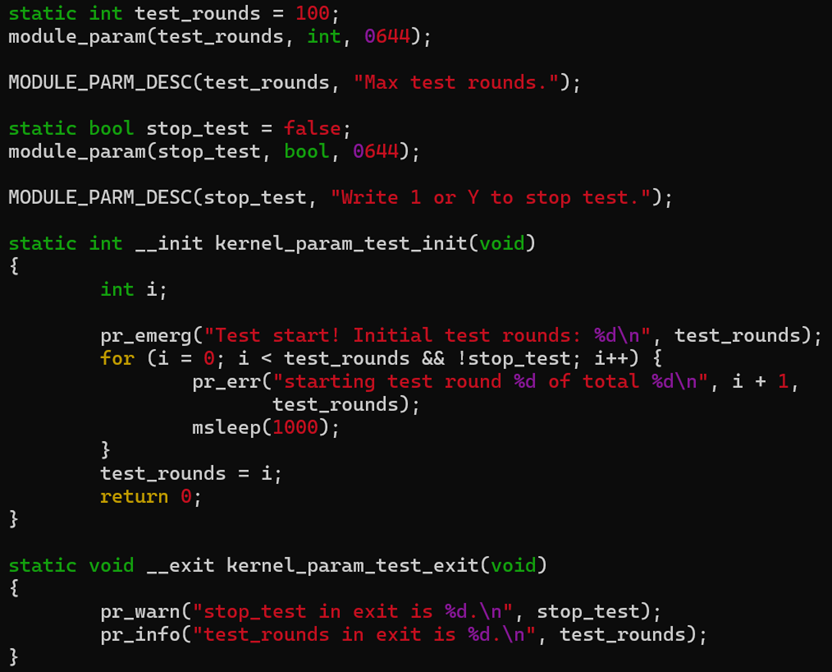
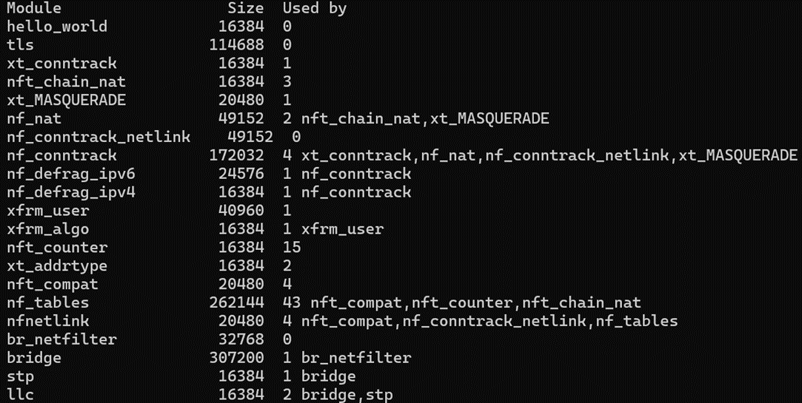
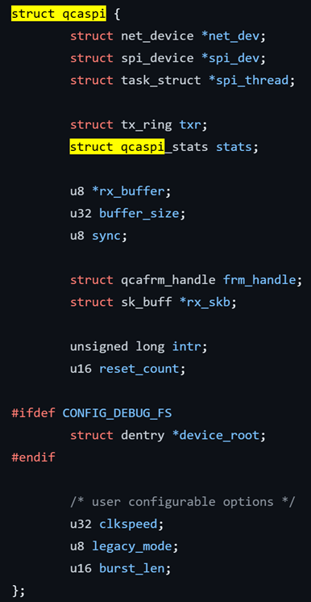

# 1. Driver overview  
Bus, device and drivers can be represented by kset and kobject.  
Kobject: object of type struct kobject.  
Kset: a set of kobjects.  
Ktype: type of object that embeds a kobject.  
  


When we enable kobject debug, we can see details of kobjects behavior.  
  
## Types
  
There are mainly 3 types of drivers, character, block and network driver. Those are functionality level.  
When we mention Platform, I2C, SPI, PCIe, USB, we mention devices relied bus.  


# 2. Kernel module overview  
In linux, a loadable kernel module (LKM) is an object file that contains code to extend the running kernel.  
Kernel modules can be device drivers, or just some extension of kernel feature.  
  
## example  
### code  


Key parts:  
Header file: linux/module.h.  
module_init(): Called when do insmod or modprobe.  
module_exit(): Called when do rmmod or modprobe -r.  
MODULE_LICENSE(): i.e. "GPL v2", "Dual MIT/GPL" means MIT or GPL.  
EXPORT_SYMBOL_GPL(): Export the symbol, restricts use in modules that are GPL-licensed.  
EXPORT_SYMBOL(): Can be used by other kernel modules, no LICENSE restriction.  
### Makefile  
```bash
obj-m: Built as  kernel module, but not link to kernel image.
obj-y: Built and link to kernel image.
obj-m += $(dbg-y): Include kernel modules in dbg-y.
dbg-$(CONFIG_ARM64): dbg-y when kernel enabled ARM64.
subdir-ccflags-y += -Werror: Treat all warnings as error.
subdir-ccflags-y += -g -O0: Enable debug, in current and subdir.
```
  
### parameters  
module_param(name， type, perm): define and register module parameters.  
MODULE_PARAM_DESC(): Description for the param.  
/sys/module/$NAME/paramteres/$PARAM: When a kernel module is loaded, a subdirectory is created under /sys/module/ with the module's name.  
code:  


output:  

### commands  
insmod:  
```bash
$ insmod kernel_param.ko [test_rounds=6]
```
The insmod command requires root privileges and needs the complete path to the kernel module, which can be either an absolute path or the current directory. Additionally, it can accept parameters for the module.  
rmmod:  
```bash
$ rmmod kernel_param module1 module2
```
No .ko suffix is specified, can use a list of kernel modules.  
lsmod:  
Get loaded modules list. See example at right.  
  
modprobe:  
```bash
$ modprobe kernel_param.ko [test_rounds=6]
```
Need kernel module in path /lib/modules/.  
```bash
$ modprobe –r kernel_param
```
-r means remove this module.  
```bash
$ depmod -a
```
Create modules.dep based on the symbols in modules.  
```bash
$ modinfo kernel_param
```
Check module parameters and other info.  
  

# 3. character driver
In /dev directory, we can see "crw-r—r--", here c means character device.  
For 10, 235, here 10 means major device num, 235 means minor device num.  
mknod can create nodes, which can be used by user process to communicate with device.  
```bash
$ mknod [-m node] /dev/name <type> <major> <minor>  
```
Major num identifies the driver for the device.  
Minor num used only by the driver to differentiate between devices.  
/dev output:  
  
  
Character Drivers key data structures are cdev and file_operations.  
Users can use read(), write(), open(), release() system calls to operate the character device.  
  
## APIs
| API                                              | Description                                 |
|--------------------------------------------------|---------------------------------------------|
| alloc_chrdev_region()/unregister_chrdev_region() | Allocate/Release character device number.   |
| cdev_alloc()                                     | Allocates a character device structure.     |
| cdev_init()                                      | Bind cdev and file_operations.              |
| cdev_add()                                       | Adds a character device to the system.      |
| cdev_del()                                       | Deletes a character device from the system. |

## Example
When we do echo, it will call file_operations write(), and do cat will call read().  
try_module_get(THIS_MODULE) can ensure this module is in use, so can’t do rmmod if modue_put(THIS_MODULE) isn’t called.  
We need copy_from_user()/copy_to_user() to safely transfer data between user space and kernel space in a Linux kernel module.  
  
  
  
  

# 4. Platform drivers  
Driver is cross platform.  
Board specific info should not appear in driver, but in device.  
We need something to connect with driver and device, that is bus. There is virtual bus called platform bus.  
For example, in platform/devices/i8042 directory, we can see driver has a soft link to drivers/i8042. It means this device has found matching driver.  
  
  
## How to differentiate devices for same driver?
Take SPI driver as example, because each ethernet device is allocated via alloc_etherdev(), so they have different net_device structure.  
And there are private data for each device, can use netdev_priv() to get it.  
[linux/drivers/net/ethernet/qualcomm/qca_spi.c at master · torvalds/linux (github.com)](https://github.com/torvalds/linux/blob/master/drivers/net/ethernet/qualcomm/qca_spi.c)  
  
  
### Device private data  
alloc_etherdev(int sizeof_priv) will allocate space for:  
struct net_device + sizeof(struct qcaspi).  
And netdev_pri(dev) will point to private data.  
  
  
  
## SPI driver example  
Although the SPI controller provides a bus for others, it is also enumerated by the platform_driver and platform_device.  
  
## Device view  
We can check devices in dir /sys/bus, /sys/devices and /sys/class.  
Usually we use /sys/class directory to control devices, as same type of devices are grouped together, and path is short than /sys/device directory.  
  


# 5. Device tree  
Originally, ARM hard code board and peripheral info in driver code, linus mentioned it is not good, device tree was used, which is much cleaner.  
The device tree is a simple tree structure of nodes and properties. Properties are key-value pairs, and node may contain both properties and child nodes. There are many benefits:  
1. Specify the order power or reset signals should be applied to devices.  
2. Simple to change config , without recompile any code.  
3. Easily add support for new hardware.  
4. Can reuse configurations in dtsi files.  
5. Can use descriptive names, so easy to read and understand.  
  
  
## DTB  
DTB mainly involves three parts: driver code, DTS files, and [documentationlinux/Documentation/devicetree/bindings/spi/qcom,spi-qcom-qspi.yaml at master · torvalds/linux (github.com).](https://github.com/torvalds/linux/blob/master/Documentation/devicetree/bindings/spi/qcom%2Cspi-qcom-qspi.yaml)  
Raspberry-pi’s dts is in:  
[linux/arch/arm/boot/dts/broadcom/bcm2711-rpi-4-b.dts at master · torvalds/linux (github.com)](https://github.com/torvalds/linux/blob/master/arch/arm/boot/dts/broadcom/bcm2711-rpi-4-b.dts)  
compatible = "<manufacturer>, <model>"  
If new compatible string is added, by no document added, then checkpatch will report "appears un-documented".  
of_machine_is_compatible("bcm,bcm2711") can check if it is compatible with this SoC.  
  
  
## compile flow  
  
DTS (Device Tree Source)：Describe the configuration and connection of hardware devices using a syntax similar to C.  
DTC (Device Tree Compiler)：A tool used to convert DTS files into DTB files.  
DTB (Device Tree Blob)：Referring to the binary form of a Device Tree Source file. This binary file is used by the operating system at boot time to understand the hardware layout and configuration.  
## example usage  
reg = <address1 length1>  
reg = <chipselect offset length>  
ranges = <childAddr offset parentAddr length>  
The ranges property is used for getting a memory mapped address. The lack of a ranges property means that a device cannot be directly accessed by any device other than it's parent.  
interrupts = <GIC_PPI 9 (GIC_CPU_MASK_SIMPLE(4) | IRQ_TYPE_LEVEL_HIGH)>  
GIC_PPI 9 means Private Peripheral Interrupt number 9.  
GIC_CPU_MASK_SIMPLE(4) means send interrupt to cores 0-3.  
IRQ_TYPE_LEVEL_HIGH means that the interrupt is triggered by a high-level signal.  
  
  
  
## Open Firmware (of) APIs
| APIs                       | Description                                                                                       |
|----------------------------|---------------------------------------------------------------------------------------------------|
| of_machine_is_compatible() | If board is compatible.                                                                           |
| of_device_is_compatible()  | If device node is compatible.                                                                     |
| of_find_compatible_node()  | locate device tree nodes that match a specific compatibility string.                              |
| of_property_read_u64()     | Read property by name.                                                                            |
| of_iomap()                 | Instead of traditional ioremap(), we can use it to map peripheral registers into the kernel’s va. |
| irq_of_parse_and_map()     | Maps interrupt info to kernel.                                                                    |
| of_find_device_by_node()   | Get platform_device by device_node.                                                               |

# 6. References  
https://tldp.org/LDP/khg/HyperNews/get/devices/devices.html
https://lwn.net/Articles/51437/
https://github.com/PacktPublishing/Linux-Kernel-Debugging
