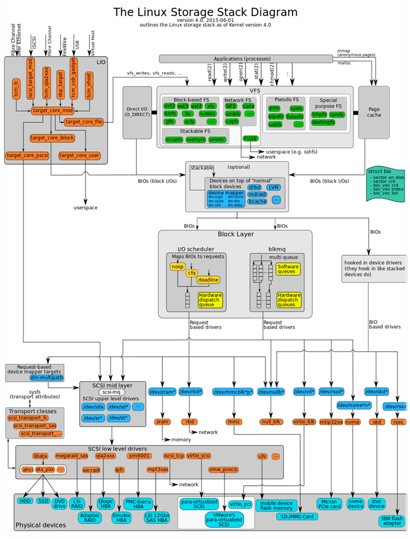
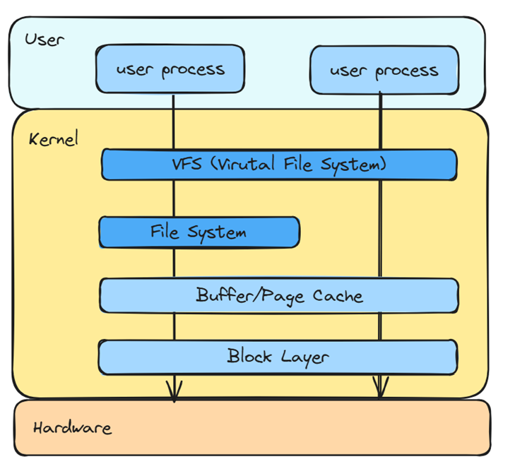
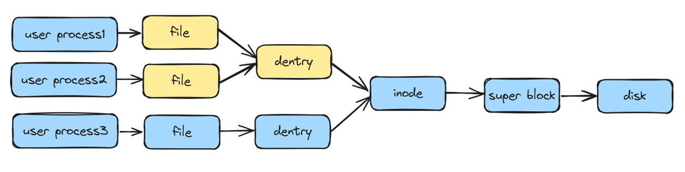
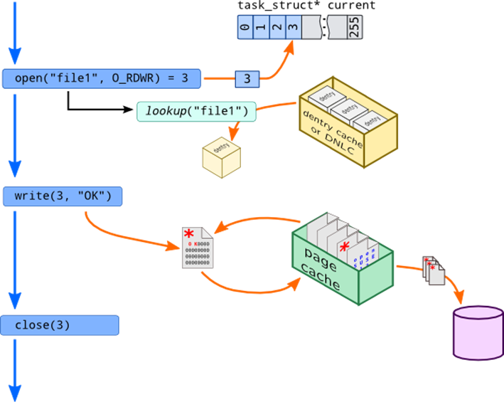
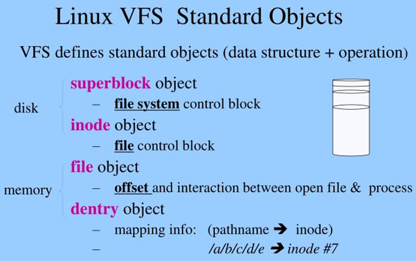

# 1. File System
Linux storage stack is very complicated, see this picture:  

File system is part of it, above buffer/page cache, and has VFS as abstract layer, so high level user APIs are common.  
  
/proc/meminfo: Cached = page cache – swapcached, Buffers = in-memory block I/O buffers for raw disk blocks.  
Drop caches:  
```bash  
$ echo 1/2/3 > /proc/sys/vm/drop_caches  
```
VFS key objects are: file, dentry, inode and super block, they have file_operations, dentry_operations, inode_operations and super_operations data structures.  
  
When we open a file and do some handling, it will actually find the inode in disk, and operate the data.  
  
VFS standard objects:  
  
