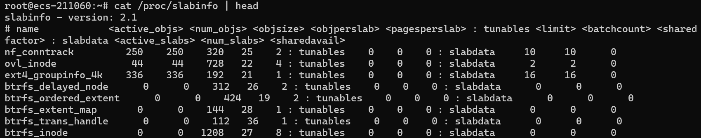
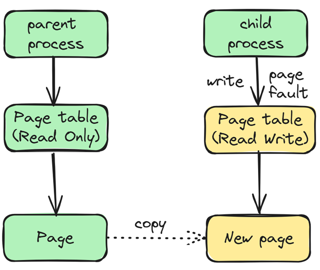

# 1. Basics  
1. Page & PageTable:  
Mostly we are using 4-level page table (pgd->pud->pmd->pte), or 5-level page table (extra p4d between pgd and pud).  
CPU connects to MMU. MMU has 4kB TLB, large TLB, and TWU (Table Walk Unit), which will traverse page table to find the addr.  
Hierarchic page table will split virtual addr space to 1G table, then 1G table to 2M table, and to 4K table, then offset points to PTE.  
Page can be translated to pfn via page_to_pfn(page), and vice versa via pfn_to_page (pfn).  
Page flags: Present, Accessed, Dirty, Read/Write, User/Superuser, PCD (Used by HW cache), PWD (write back), Page Size.  
  
ARM systems use Translation Table Base Registers (TTBR0 for user space and TTBR1 for kernel space) to manage different regions of the address space. 4-Level Page Tables usually use 48-bit VA, and 5-Level Page Tables usually use 57-bit VA.  
2. Zone:  
In 64-bit system, there are ZONE_DMA (24bit ISA DMA, 0-16MB), ZONE_DMA32 (16MB-4GB), ZONE_DEVICE, ZONE_NORMAL (16MB-Highest) and ZONE_MOVABLE.  
In 32-bit system, there is also ZONE_HIGHMEM (896MB-Highest).  
3. NUMA:  
NUMA has distance between nodes. Automatic NUMA balancing moves tasks (which can be threads or processes) closer to the memory they are accessing. It also moves application data to memory closer to the tasks that reference it.  
4. Memory Model:  
Currently we have 3 kinds of models, can get page via:  
    a. flat mem: mem_map[PFN]  
    b. discontig mem：node_mem_map[PFN-OFFSET]  
    c. sparse mem: PFN, vmemmap -> section_mem_map[]  
5. Types of addresses:  
User virtual addr, physical addr, bus addr, kernel logic addr (same as kernel virt addr in 64 bit system).  
0 -> PAGE_OFFSET is user space, PAGE_OFFSET -> 4GB is kernel space.  

# 2. Allocators  
1. Buddy Allocator  
It can allocate continuous VA and PA area, min block size is 4kB (order 0), max block size is 4MB (order 11).  
Buddy has free_area[] array in struct zone, points to page linked lists.  
There is also per_cpu_pages linked list, has hot pages and cold pages for order 0, will use hot pages firstly.  
APIs: alloc_page(gfp_mask)/alloc_pages(gfp_mask, order)/free_page(addr)/free_pages(addr, order).  
  
Check usage via: cat /proc/buddyinfo  
  
If ZONE_NORMAL is used up, it will go to ZONE_DMA32 and DMA to do alloc.  
Buddy allocator’s max continuous block is 4MB, both PA and VA are contiguous. Support merging small adjacent pages, and split big blocks.  
2. Vmalloc Allocator  
It can allocate continuous VA and dis-continuous PA area, no max block size restriction (only restrict by avail va and pa).  

VA is using struct vmap_area to manage, from free_vmap_area_root, no max block size restriction.  
PA is pages from Buddy Allocator.  
PageTable: can find vmap_area, then find vm_struct, and pages.  
APIs: vmalloc(sz)/vfree(addr).  
Future memory management will use maple-trees. The red-black trees of the memory vma area will be replaced.  
Check usage via: cat /proc/vmallocinfo  

3. Slab/Slub/Slob Allocator  
The Slub allocator is the default slab allocator in modern Linux kernels. It is designed to be simple and efficient. Slab allocator is original allocator. SLOB allocator is for very limited memory system, like embedded systems.  
It is pre-allocated for specific size, or specific structures, so in runtime, it is very fast to use.  

Pages also from Buddy allocator, use struct slab and struct kmem_cache to maintain.  
APIs: kmalloc(size, gfp)/kzmalloc(size, flags)/kfree(addr)/kmem_cache_create(). There are also mempool_create/_alloc/_free() APIs. Max block size is 128kB.  
Check usage via: cat /proc/slabinfo   

4. CMA (Contiguous Memory Allocator)  
For buddy allocator, it can use max 4MiB, but in some scenarios, we need > 4MiB memory, so we need CMA, and used together with DMA.  
CMA buffers can give back to buddy when mem pressure is high.  


# 3. Mappings  
Kernel has several different memory sections, details can see this picture:  
  
1. Linear mapping  
Linear mappings refer to particular way of mapping virtual pages to physical pages, where virtual page V, V + 1, ... V + n is mapped to physical pages P, P + 1, ..., P + n.  
*va = __va(pa);    *pa = __pa(va);

It can use ZONE_DMA, ZONE_NORMAL.  
Start from __START_KERNEL_map, and can use APIs __pa() and __va() to quick calc PA and VA.  
2. Temporary mapping  
Temporary mappings are used for creating short-lived mappings of memory regions in the kernel's address space, typically for operations that require direct access to physical memory. Those memory will create temporary mapping when needed.  
  
RSVDMEM: memmap(), va from vmalloc area.  
MMIO: ioremap(), va from vmalloc area.  
ZONE_HIGHMEM: kmap(), va from fixmap area, it is PFN mapped mem.  
3. Fix mapping  
Fix mappings are used for APIC, KMAP, PCIe MCFG, IO-APIC.  
*vaddr = fix_to_virt(index);
*index = virt_to_fix(vaddr);
  
APIC, KMAP, PCIe MCFG, IO-APIC will use fix mapping.  
For permanent mapping, same VA will be used during kernel startup and runtime usages.  
4. File mapping  
In kernel mode, there is page cache, and user mode will create pagetable, mapping va to page cache.  
Without this mapping, we will need use copy_to_user and copy_from_user APIs to transfer data.  
copy_from_user is copy from user process's kernel space to user space.  
The copy_from_user() function is necessary because:  
    a. The buffer pointed to by the pointer may be freed by user space, and kernel space does not know about it. Moreover, other processes in kernel space do not know the specific PA that this VA points to.  
    b. It also checks whether the address is truly from user space; if it's from kernel space, then no copy is needed.  
5. Anonymous mapping  
Anonymous page will use anon vma, and pagetable to map. We can call mmap() API with MAP_ANONYMOUS flags.  
 
vma_is_anonymous() function can know if it is anonymous mapping.  
6. Shared mapping  
Different tasks, use different page table to points to same physical page, so data can be shared. i.e. for Task A and B, if they need share some memory, they can use mmap() API with MAP_SHARED flags.  
  
Here Xarray and page table are both using radix tree.  
It can use shared file (file shared mem), pseudo file (anon shared mem), or tmpfs file (shared mem) to share with different processes/threads.  
7. PFN mapping  
Reserved mem and MMIO can use PFN mapping, in VMA, flag VM_PFNMAP will be added.  
8. Reverse mapping  
Reverse mapping will use address_space mapping field to get anon vma, then get anon vma chain, finally got vma for virtual addresses.  
  
Folio is similar as compound pages. It can manage larger blocks of memory more efficiently than the traditional page abstraction, size can be 64KB, 2MB, etc.  
It can be used in mem migrate, reclaim, compact scenarios.  
Normally it is:  
Page -> anon vma -> vma, when it is anon mapping (mapped by VMA -> anon VMA).  
Page -> address_space -> vma, when it is file mapping (mapped by VMA -> file -> inode -> address_space -> XARRAY).  

# 4. Flags  
|Flags|Decription|
|--|--|
|GFP_KERNEL|Implies GFP_RECLAIM, which means it may trigger direct reclaim under memory pressure; the calling context must allow sleeping.|
|GFP_ATOMIC|Alloc from an atomic context, such as irq, softirq, spinlock. Prevents direct reclaim, I/O or filesystem operations. Still can alloc mem when water mark is lower than MIN, but bigger than ¼ * MIN. In latency critical path, can also use GFP_ATOMIC.|
|GFP_NOWAIT|Alloc from an atomic context, such as interrupt handler. Prevents direct reclaim, I/O or filesystem operations. Under memory pressure, allocations may fail.|
|GFP_USER|Allocate memory for user space processes, allowing allocation to block if necessary.|

# 5. MISCs  
1. Kernel space setup  
kernel will start from 0x7c00 in old config, while in new config, it can start from 0x100000 or other addr.  
Will load kernel image, and map sections like .data, .text, .bss and .__start.  
Then create linear mapping, vmalloc area and others.  
2. User space setup  
After create user process/ thread, each thread will have a task_struct, and points to mm_struct, there is pgd points to page table, and there are several vmas used for different mapping areas.  
When using user space mem, there are several ways, like Pre Alloc (VA + PA + PageTable), Lazy Alloc (VA) and On-Deman Alloc (VA, on-demand alloc PA + PageTable).  
For malloc() API, there are 2 sizes, > 128kB, it uses mmap(), < 128kB, it uses brk() API.  
3. Copy On Write  
After fork, child process will have the resources owned by the parent, i.e. signal, open files, addr space. Resources are controlled via clone() flags, like CLONE_VM/FS/FILES/SIGHAND.  
Parent process's page table is marked as read only, and child process's page table is also read only. They have separate page tables, but map to same PA addr space. Because they share same vma mapping, so read can get same data. If child process write to the page, then page fault will be triggered, and new page allocated, parent's page data will be copied to child.  
When page is not mapped, there will be a page fault triggered, and handle_mm_fault() is called, then it will alloc pages from buddy allocator, and create page table accordingly.  
  
When parent or child write to the page, a page fault will be triggered, the page will be copied, and page table is updated.  
  
4. SWAP  
For anonymous mem, page table will store swap entry.  
For file mapped, or shared mem, swap entry will be stored in XARRAY, vma -> file -> inode -> address_space.  
Swap space contains swap entry, and physical pages can be recycled.  
For better performance, usually we disable swap by swapoff -a.  
5. ZSWAP  
Performance is better than swap, as it can be compressed in RAM, and no need to do disk IO.  
Page will be compressed, and stored in ZSWAP pool's zswap entry. There are special allocators like zsmalloc, zbud, z3fold.  
6. Reclaim  
a. There is watermark for reclaim usage, if free pages < WMARK_HIGH, hysteric's field low_on_memory will be set, until free pages become WMARK_HIGH, when low_on_memory is set, allocator will free some mem if GFP_WAIT is set.  
b. LRU lists. There are lruvec used for storing the pages, which belongs to active/inactive anon/file, when __alloc_pages_nodemaks() is called, it can start page reclaim, directly by APIs like shrink_active_list() or kswapd thread. Inactive pages will be firstly reclaimed.  

c. Zone ref lists. In NUMA env, there are many zones can be used, and if higher zone is used up, can use lower zones (NORMAL used up -> use lower DMA32 zone). After mem is freed, reclaim will do its job.  
7. Hugepage  
There are 2 kinds of hugepages normally, one is hugeTLB fs, and another is Transparent HugePage.
THP will migrate scattered 4k pages to 2M pages, so performance is worse than normal hugepage.  
Normal hugepage can be reserved in manually via: 
```bash
# Reserve 6G hugepages.  
echo 6 > /sys/kernel/mm/hugepages/hugepages-1048576kB/nr_hugepages   
```
THP can be used via:  
```bash
# Enable  
echo "madvise" > /sys/kernel/mm/transparent_hugepage/enabled  
# Disable
echo "never" > /sys/kernel/mm/transparent_hugepage/enabled  
```
The main difference is that the Transparent HugePages are set up dynamically at run time by the khugepaged thread in kernel while the regular HugePages had to be preallocated at the boot up time.  
9. Per cpu variables  
Per cpu variables don't need extra synchronizations, so it is fast for use.  
DEFINE_PER_CPU(type, var)  
get_cpu_var(var);  
put_cpu_var(var);  
10. Useful device nodes  
Those nodes are useful for debug, like /dev/mem and also kmem, null, port, zero, random, urandom, kmsg.  
i.e. we can read kernel physical mem via /dev/mem, and create a zeroed file by dd from /dev/zero, also output to /dev/null.  
# 6. Debug  
OOM: Usually there are OOM logs, we can check which file/anon and each zone's free mem.  Also can check /proc/meminfo for Buffers, Cached, Shmem (Shmem and tmpfs), slab, vmallocused, usages.  
Overwrite: Can use mprotect() to protect that page after write, and when others write it, it will trigger crash, so we can know who did that.  
Kernel mem leak: we can use kmemleak tool or config option.  
User mem leak: can check VSS/RSS/PSS/USS via smem tool collection.  

# 7. References  
https://lbomr.xetlk.com/s/4Ah3Md  
https://github.com/BiscuitOS/BiscuitOS  
https://www.kernel.org/doc/Documentation/sysctl/vm.txt  
https://www.kernel.org/doc/html/latest/core-api/wrappers/atomic_t.html  
https://dl.acm.org/doi/pdf/10.1145/3342195.3387517  
https://storage.googleapis.com/pub-tools-public-publication-data/pdf/43438.pdf  
https://cloud.tencent.com/developer/article/1821725  
