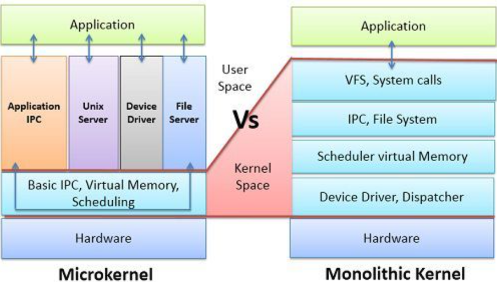
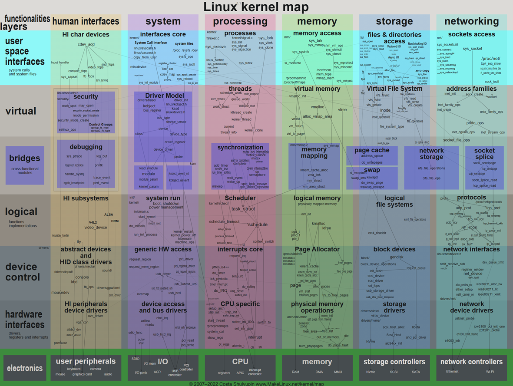
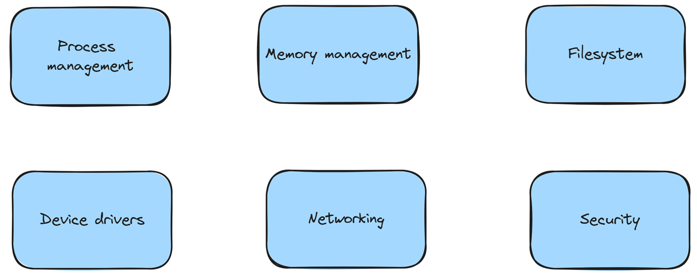
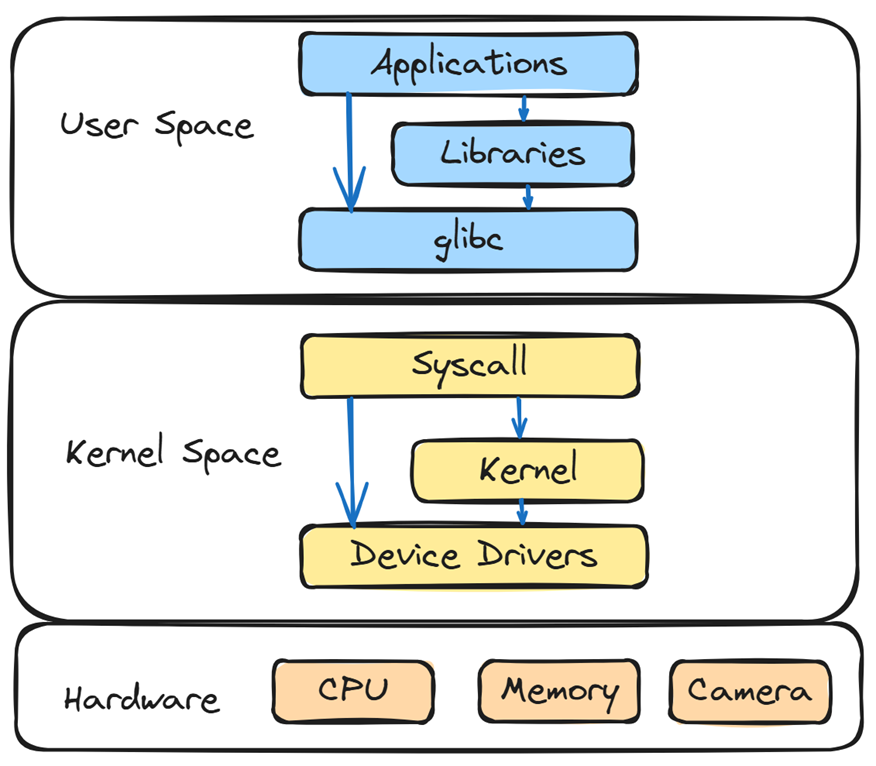
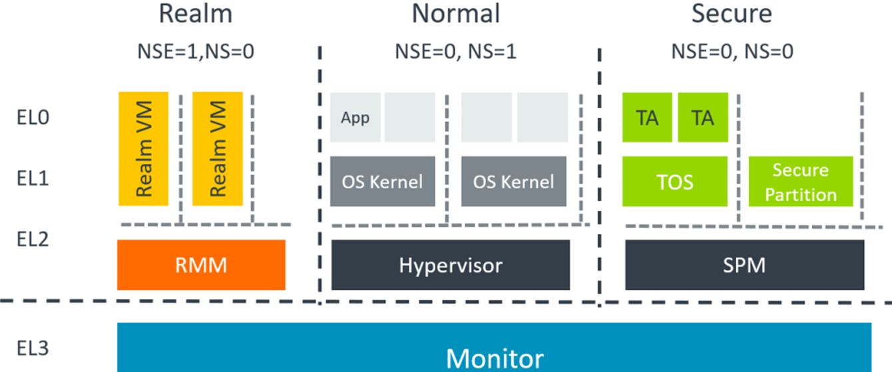
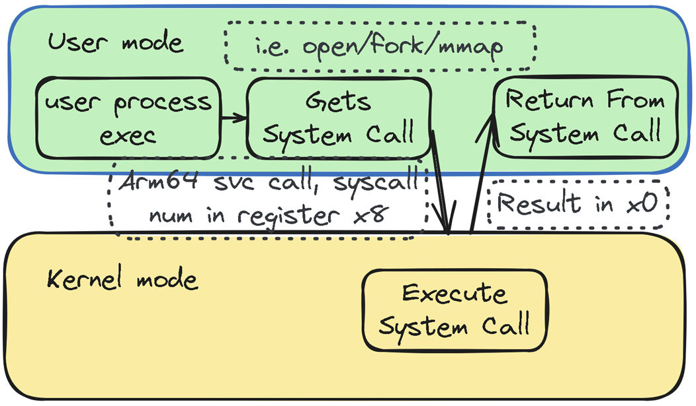
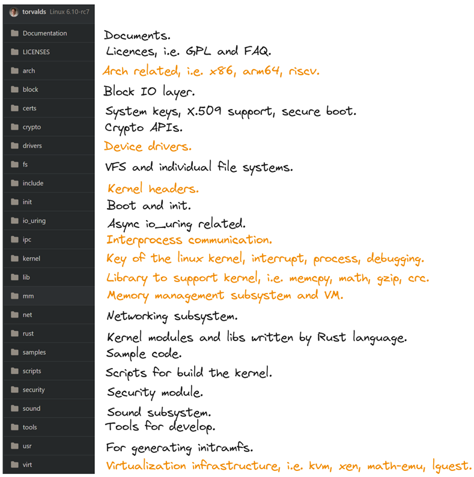
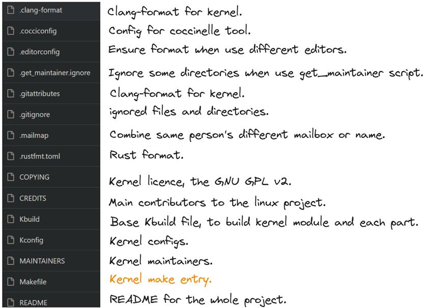

# 1. Kernel overview
Linux kernel is using monolithic kernel, while in automotive, it is mainly using micro kernels, like QNX.  

Kernel has many components, for details, we can check:

It is from https://makelinux.github.io/kernel/map/.
For

# 2. User space and kernel space  
Kernel space is strictly reserved for running a privileged operating system kernel, kernel extensions, and most device drivers.  
In contrast, user space is the memory area where application software and some drivers execute, typically one address space per process.  
User space can switch to kernel space via syscall interface.  
Syscall can also access device drivers directly via ioctl() call.  
  
In ARM, it is separated by exception levels.  
User Space：EL0 (Exception Level 0).  
Kernel Space：EL1. The Supervisor Call (SVC) instruction enables a user program at EL0 to request an OS service at EL1.  
Hypervisor : EL2. The Hypervisor Call (HVC) instruction enables the OS to request hypervisor services at EL2.  
Secure monitor: EL3. The Secure Monitor Call (SMC) instruction enables the Normal world to request Secure world services from firmware at EL3.  
  
|Feature|Type 1 Hypervisor|Type 2 Hypervisor|
|--|--|--|
|Installation|Directly on hardware|On top of host OS|
|Performance|High|Moderate|
|Use Case|Automotive|Desktop|
|Complexity|High|Low|
|Resource Usage|Efficient|More overhead|
Gunyah is type 1 hypervisor, run directly on the host's hardware, to control the hardware and manage guest operating systems. Known as bare-metal hypervisors.  
Type 2 hypervisor run on top of host OS, as a software layer or application. Known as hosted hypervisor.  
User process can switch to kernel mode via syscalls.  
We can use strace to track syscalls and rough latency, use ftrace to track syscall detail latency.  

# 3. Kernel source  
Talk is cheap, show me the code.  
Kernel has many directories:  
  
And files:  
  
