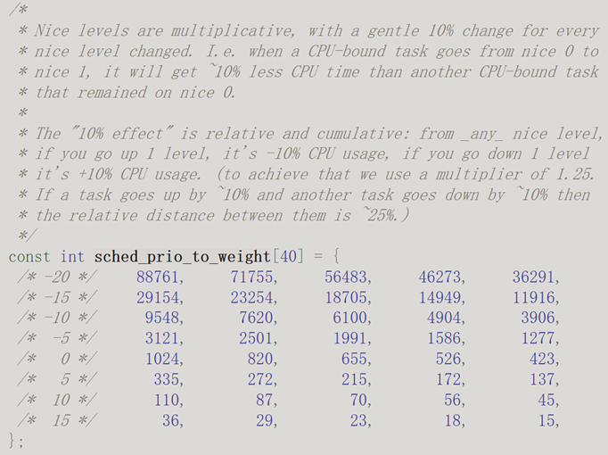

# 1. Why need schedule   
New tasks can interrupt already started ones before they finish, instead of waiting for them to end. As a result, a computer executes segments of multiple tasks in an interleaved manner.  
It allows the system to deal rapidly with important external events like incoming data, which might require the immediate attention of one or another process.  
  
Scheduler's main task is time-sharing among tasks, need perform context switch.  

# 2. Tasks  
In linux, both process and thread are described with task_struct.  
  
kthread_create() init process in sleeping state.  
kthread_bind() bind process to a physical core.  
kthread_run(), run with threadfn(data), and namefmt is name.  
kthread_stop(), stop the thread.  
We can also create per-cpu threads via for_each_online_cpu(cpu).  

Idle process created init and kthreadd in start_kernel()->rest_init() function, then created other user processes/threads and kernel threads.  
  
The kernel_clone() API can create new processes.  
  
In the kernel, each thread has its own ID, called a PID, although it might make more sense to call it a TID or thread ID.  
Kernel also has a TGID, which is the PID of the first thread created when the process is created.  
  
|User view|Kernel view (task_struct)|
|--|--|
|TID|PID (Process Id)|
|PID|TGID(Thread Group Id)|
|Original parent process|real_parent|  
A task_struct has two parent fields, real_parent represents the process that created it, and the parent can be a debugger, such as gdb. We usually use real_parent to retain the information about the original parent process.  

Task has different states:  
  

# 2. Scheduler history  
|Scheduler|Description|
|--|--|
|Multilevel feedback queue|O(n), Linux 2.4.|
|Runqueue|O(1), Linux 2.6 – Ingo_Molnár.|
|SD (Staircase scheduler)|RSDL (Rotating Staircase Deadline Scheduler), fair scheduling.BFS (Brain Fuck Scheduler).|
|CFS (Completely Fair Scheduler) |Insert O(logn), lookup O(1). Ingo_Molnár|
|Group schedule|Controlled by cgroup.|
|EEVDF (Earliest Eligible Virtual Deadline First)|posted by Peter Zijlstra, offers the possibility of improving on CFS while reducing its dependence on often-fragile heuristics.|
|sched_ext (BPF-extensible scheduler class)|If a task explicitly sets its scheduling policy to SCHED_EXT, it will be treated as SCHED_NORMAL and scheduled by CFS until the BPF scheduler is loaded.|
### EEVDF scheduler
EEVDF (Earliest Eligible Virtual Deadline First): A task is considered "eligible" when it is ready to execute without being blocked by dependencies such as I/O operations. The priority of tasks is dynamically calculated based on their virtual deadlines. This means that the priority can shift based on the urgency of tasks and the state of the system.  
Mainly for solving QoS related, some tasks need low latency.  
Solving by deadline-driven, focues on meeting the deadlines of tasks.  
Add slice for calculating deadline, and pick_eevdf() for select schedule entity.  
### sched_ext  
SCHED_EXT: Another way, which can use BPF to have scheduler plugins, more flexible. It is between SCHED_NORMAL and SCHED_IDLE.  

# 3. Scheduling classes  
  
There are 5 sched classes, defined by sched_class struct.  
Each sched class's next pointer will store next one. Highest priority is stop class (take cpu offline).  
Schedule class will traverse via order:  
stop_sched_class->dl_sched_class->rt_sched_class->fair_sched_class->idle_sched_class.  
pick_next_task() will select a new task_struct to run, by scheduling classes and policies.  
Each cpu will pop tasks from it's run queue.  
  
### RT schedue class  
  
RT schedule class’s schedule entity (se) is sched_rt_entity, can be FIFO or RR schedule policy tasks, they are chained together via linked list by different priority array.  
High priority can preempt low priority.  
Time complexity is O(1).  
Normally /proc/sys/kernel/sched_rt_runtime_us value is 950000 (0.95s, sched_rt_period_us is usually equal to 1s), if update to -1, it might cause rt process cost too much CPUs, and SCHED_NORMAL process can't get scheduled.  

### Fair schedule class  
Currently we are using CFS (Completely Fair Scheduler) for fair schedule class.  
  
fair_sched_class:   
virtual_runtime += delta_exec * NICE_0_LOAD / weight  
For example:  
A: delta_exec=3ms, niceA=-2, vruntimeA=3ms*(1024/1586)=1.93ms  
B: delta_exec=3ms, niceB=0, vruntimeB=3ms*(1024/1024)=3ms  
sched_period = sysctl_sched_latency, nr_running *sysctl_sched_min_granularity  
ideal_runtime = sched_period * (task.weight / cfs_group.weight)  
   
CFS is scheduled by least vruntime. So process with lower prio, vruntime 2 can be picked before high prio, vruntime 7.  

# 4. Scheduling policy  
We can set scheduling policy via sched_setscheduler().  
Mostly used policies are:  
1. SCHED_NORMAL: Time equal (vruntime in CFS). Nice value is used for configure the priority and vruntime (10% for each nice level).  
    Here CFS is using red-black tree to store tasks, left most node is smallest vruntime task, priority is 100-139 (nice -20 to +19).  
    vruntime = delta_exec ∗ weight_nice_0 / weight.  
2. SCHED_FIFO: First In First Out.  
3. SCHED_RR: RoundRobin.   
SCHED_FIFO/RR is using array and linked-list to store, priority is 0-99.
4. SCHED_IDLE: It is actually a CFS task, weighted as 3.  

# 5. Priority
|Priority|Deadline|Realtime|Normal|
|--|--|--|--|
|static_prio|Always 0|Always 0|MAX_RT_PRIO(100) + nice + 20|
|rt_priority|Always 0|1-> 99 (1 is lowest)1-> (MAX_RT_PRIO-1)|Always 0|
|normal_prio|-1|99 – rt_priority|static_prio|
|pri_baz (0-139, 0 is highest priority)|pri_baz == normal_prio, except priority inheritance, prio = inherited high prio.|||
  

### Priority inversion and inheritance  
  
Priority inversion:  
If tasks 1 and 2 share same resource, protected by mutex, and 2 priority is higher than 1.  
If 1 is holding the lock, then 2 need wait. If there is another task priority higher than 1, then 2 also need wait.  
  
Priority inheritance:  
Task 2 will inherit the high priority from task 1, when it acquires the lock. Now priority inheritance is only used in user space. i.e. in futex.  

# 6. Load balance  
There are mainly 3 types of load balance, tick/periodic load balance, nohz idle load balance and new idle balance. They are use same load_balance() function in fair.c as code entry.  
1. For tick/periodic load balance, it is used in busy CPU with PELT (Per-Entity Load Tracking) algorithim, formula is:  
```c
L = L0 + L1*y + L2*y2 + L3*y3 + ...  
```
L: This is the value of the polynomial.  
y: This is the variable of the polynomial.  
Li: These are the coefficients of the polynomial. Each coefficient corresponds to a specific term in the polynomial.
Coefficients.  
https://lwn.net/Articles/531853/  
  
2. For nohz idle load balance, it means other CPUs is in idle state, this CPU load is too high, need ipi to wakeup other idle CPUs, to do load balance.  
3. For new idle load balance, it means this CPU has nothing to do, will enter idle state, check if other CPUs is busy or not, if busy, then pull task from other CPUs, so system is in balanced state.  

# 7. cgroup  
Control Group can be used for group scheduling.  
  
We can set CONFIG_SCHED_AUTOGROUP to automatically group the tasks, or disable it and manually set by cgroup. Cgroupv2 is using unified hierarchy, controllers are set inside each cgroup.  
If cgroup.type is set as threaded, it can put different threads in same process to different cgroups. i.e. Process A contains thread A and B, thread A in cgroup1 and thread B in cgroup2.  
  
Struct task_group is basic unit of group schedule.  
We can set cgroup node to threaded type, by this command:  
```bash
$ echo threaded > cgroup.type
```
Note that we can't set back to domain after set to threaded.  
Currently we need use cgroupv2, instead of cgroupv1, because systemd is stop supporting cgroupv1.  
We can create different cgroups to control resources like cpuset, cpu, memory.  
In cgroupv1, the default CPU share value is 1024, while in cgroupv2, the default CPU weight (same meaning as share) is 100, with the minimum share/weight being 1. These parameters are controlled via sched_min_granularity_ns and sched_wakeup_granularity_ns.  

# 8. Affinity  
Process affinity:  
sched_getaffinity() and sched_setaffinity().  
Or use:
```bash
# set  
taskset -p $affinity $pid  
# show
taskset -p $pid  
```
Interrupt affinity:  
irq_set_affinity_hint(irq, affinity).  

# 9. Limit & Capabilities
Process resources can be controlled via getrlimit() and setrlimit().  
Capabilities can be checked via capable(), i.e. capable(CAPS_SYS_ADMIN).  
We can use capget/capset() functions to handle the capabilites.  

# 10. Debugging scheduling latency  
If we are seeing scheduling latency, usually we can check schedstat, top, ftrace, and /proc/interrupts.  
```bash
# schedstat need CONFIG_SSCHEDSTATS=y, implementation can check show_schedstat().  
echo 1 > /proc/sys/kernel/sched_schedstats  
# Whole system  
cat /proc/schedstat  
# pid detailed sched stats  
cat /proc/<pid>/schedstat  
cat /proc/<pid>/sched  
```
For top, we can press 1 to see the all the cpu's usage, espeically check interrupt (hi, si) and iowait (wa) usage. 
For ftrace, we can use function/function graph/event/kprobe/uprobe traces with tracefs, or C code, like kprobe has pre-/post-/fault-/break-handler, most common usage is function/event trace, only filter with some suspicious functions to see if they are called. Another is kprobe, like add in pre- handler, like a callback function for specific usage.  
/proc/interrupts can also checked to see the interrupt status, we can also check spurious interrupt.  
We can check nr_switches, nr_voluntary_switches and nr_involuntary_switches.  
Also other tools like strace, latencytop, powertop are good for specific scenarios.  
WARN_ONCE(condition, format) and BUG(), BUG_ON(condition) and panic() can also be used for debug.  
We can also use gdb(kgdb is also OK)/crash tools, and create debugfs/procfs if needed, procfs is using seq_file APIs.  
We can use perf tool to see the page fault count, minor/major.  
Sometimes maybe system has RCU stall, or dead lock issues, we can check from output logs accordingly.  

# 11. Virtualization  
There is full virtulizatoin, and para virtualization.  
For x86:  
1. Software Para-Virtualization:  
Ring 0 is hypervisor and host OS. Ring 1 is guest OS. Ring 3 are apps.  
2. Software Full-Virtualization:  
Ring 0 is hypervisor. Ring 1 is guest OS. Ring 3 are apps.  
3. Hardware Full-Virtualization:  
Ring 0 is hypervisor and guest mode. Ring 3 are apps.  
  
Hypervisor won't care about what guest OS will run above them, it can isolate VMs, provide resources like mmio or PCI to VMs. The virtual resource like DMA can access memory directly. It requires IOMMU to translate GPA to HPA.  
Linux kernel has KVM to support full virtualization. Qemu can work together with KVM.  
### virtio-mmio  
Virtio-mmio is a memory-mapped I/O version of Virtio devices. Virtio is a virtualization standard for network and disk device drivers, designed to provide high-performance I/O virtualization. Virtio-mmio is particularly suitable for embedded systems or environments with limited resources. Nowadays, we can also use virtio-pci, instead of virtio-mmio.  
  

# 12. References  
https://www.kernel.org/doc/html/latest/scheduler/index.html  
https://www.kernel.org/doc/html/latest/core-api/wrappers/atomic_t.html  
https://dl.acm.org/doi/pdf/10.1145/3342195.3387517  
https://storage.googleapis.com/pub-tools-public-publication-data/pdf/43438.pdf  
https://cloud.tencent.com/developer/article/1821725  
