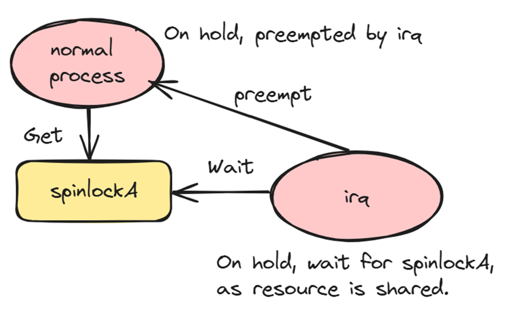

Kernel execution is asynchronous, irq, softirq, tasklet, kernel threads can preempt each other, and there are compiler reordering, out-of-order execution, so we need synchronization methods.  
# 1. Synchronization methods  

We should note some basic rules like:  
we can’t call functions which can trigger schedule in spinlock protected critical sections, as it will switch out and cause other spinlocks wait for long time.  
We can’t use mutex related APIs inside interrupt handling routines, as it can sleep and switch to other processes.
There are other optimized forms of spinlocks, such as rwlock(), seqlock() APIs.  
|Some mechanisms         |Description                                                                                            |
|------------------------|-------------------------------------------------------------------------------------------------------|
|Atomic operation        |For variable of type atomic_t, memory order can be relaxed or full.                                    |
|Spinlock                |Poll lock until available. Expected wait time is short. Interrupt context also fine.                   |
|Mutex (Mutual exclusion)|Sleepable, suitable for longer critical sections. Faster than Semaphore.                               |
|Semaphore               |Control access to a resource pool of finite size.                                                      |
|Seqlock                 |Multiple readers and one writer, ensure consistency by sequence numbers.                               |
|RWLock                  |Allow access by multiple readers or a single writer at any one time.                                   |
|Preemption disable      |Prevent the current task from being preempted by higher priority tasks.                                |
|RCU (Read-Copy-Update)  |Writers make a copy of the data, modify this copy, and then update pointers to point to the new version|
|Reference counts        |kref APIs to maintain the references, if it reaches zero, release the object.                          |
|Completion              |Provides a way for a thread to wait for an event by another thread.                                    |
# 2. Spinlock  
Head file is linux/spinlock.h, data type is spinlock_t. There are also other APIs like spin_trylock(), spin_is_locked(), spin_unlock_wait(). Can enable kernel config DEBUG_SPINLOCK to debug spinlock issue.  
|Scenario                |Get lock                                                                                               |Release lock                                                  |
|------------------------|-------------------------------------------------------------------------------------------------------|--------------------------------------------------------------|
|Simplest, no interrupts or bottom halves access shared resource.|spin_lock()                                                                                            |spin_unlock()                                                 |
|Avoid interrupt which also try to access same resource. If use simple spinlock, warning could happen: inconsistent {IN-HARDIRQ-W} -> {HARDIRQ-ON-W} usage.|spin_lock_irqsave() = spin_lock() + local_irq_save()                                                   |spin_unlock_irqrestore() = spin_unlock() + local_irq_restore()|
|Similar as above, except it does not save interrupt state.|spin_lock_irq() = spin_lock() + local_irq_disable()                                                    |spin_unlock_irq() = spin_unlock() + local_irq_enable()        |
|Avoid bottom half interrupted by other softirqs or tasklets.|spin_lock_bh() = spin_lock() + local_bh_disable()                                                      |spin_unlock_bh() = spin_unlock() + local_bh_enable()          |  

There are several types of spinlock implementation:  
|    Implementation           |Description                        |Pros                 |Cons                   |
|-----------------------------|-----------------------------------|---------------------|-----------------------|
|TAS spinlock (test and set)  |State by locked and unlocked.      |Easy to implement.   |Threads are not served in the order they arrive.|
|Ticket based spinlock        |State by owner and next.           |Served in the order. | Cache contention.                              |
|Queued spinlocks  (MCS lock) |State by locked, pending and tail. |Served in the order. | Complicated implementation.                    |

Each thread only spins on its own node.
qspinlock fields are:  
  
Each thread that wants to acquire the lock gets a node in a queue.     
struct of qspinlock is:  
  
Note that in linux preempt RT patch, spinlock is also preemptable.  
Note that when use GPIO together with IRQ, spinlock need to use spin_lock_irqsave()/spin_unlock_irqrestore(), because it is also inside interrupt context.  

# 3. Mutexes  
  
APIs:  
Init: compile time DEFINE_MUTEX(), or runtime mutex_init().  
Lock: mutex_lock(), mutex_lock_interruptible(), mutex_lock_killable().  
Unlock: mutex_unlock().  
Other: mutex_trylock(), mutex_is_locked().  

Wait_lock is using spin_lock. Note mutex must be released by original owner, and can't be applied recursively, and can't be used in interrupt context.   
We can enable kernel config DEBUG_MUTEXES, DEBUG_RT_MUTEXES or DEBUG_WW_MUTEX_SLOWPATH to debug mutex issue.  

# 4. Atomic operations  
|API group                  |Integer                                                                                                |Bit                                                           |
|------------------------|-------------------------------------------------------------------------------------------------------|--------------------------------------------------------------|
|Set                     |atomic_set()/atomic64_set()/                                                                           |set_bit()/clear_bit()/change_bit()                            |
|                        |atomic_add()/atomic_sub()/                                                                             |                                                              |
|                        |atomic_inc()/atomic_dec()                                                                              |                                                              |
|Get                     |atomic_read()/atomic64_read()                                                                          |ffz(), ffs(), fls()                                           |
|Set and test            |atomic_inc_and_test()                                                                                  |test_bit()/test_and_set_bit()/test_and_clear_bit()/test_and_change_bit()|
|                        |atomic_inc_return()                                                                                    |                                                              |
|With mem barrier        |atomic_load_explicit()/                                                                                |atomic_fetch_or_explicit()/                                   |
|                        |atomic_store_explicit()/                                                                               |atomic_fetch_and_explicit()                                   |
|                        |atomic_exchange_explicit()                                                                             |                                                              |

Note that find_first_zero_bit()/ find_next_zero_bit()/ find_first_bit() are not atomic, still need spinlock to protect. Actually atomic_read(v) is READ_ONCE((v)->counter), and atomic_set(v, i) is WRITE_ONCE(((v)->counter), (i)).

# 5. rwlock  
|API group                  |Lock                                                                                                   |Unlock                                                        |
|------------------------|-------------------------------------------------------------------------------------------------------|--------------------------------------------------------------|
|Read                    |read_lock()/                                                                                           |read_unlock()/                                                |
|                        |read_lock_irqsave()/                                                                                   |read_unlock_irqrestore()/                                     |
|                        |read_lock_irq()/                                                                                       |read_unlock_irq()/                                            |
|                        |read_lock_bh()                                                                                         |read_unlock_bh()                                              |
|Write                   |write_lock()/                                                                                          |write_unlock()/                                               |
|                        |write_lock_irqsave()/                                                                                  |write_unlock_irqrestore()/                                    |
|                        |write_lock_irq()/                                                                                      |write_unlock_irq()/                                           |
|                        |write_lock_bh()/                                                                                       |write_unlock_bh()                                             |
|                        |write_try_lock()                                                                                       |                                                              |

Concurrent Reads: Multiple threads can acquire the lock in read mode at the same time.  
Exclusive Writes: Only one thread can acquire the lock in write mode, and it will block readers and other writers.   
Use Case: Suitable for scenarios where read operations are much more frequent than write operations, such as reading from a shared data structure.  

# 6. seqlock  
seqlock(): Used when value rarely changed.  
|API group                  |Read                                                                                                   |Read retry                                                    |
|------------------------|-------------------------------------------------------------------------------------------------------|--------------------------------------------------------------|
|Read                    |read_seqbegin()/                                                                                       |read_seqretry()/                                              |
|                        |read_seqbegin_irqsave()                                                                                |read_seqretry_irqrestore()                                    |

Concurrent Reads: Readers do not actually do any locking, but instead read the sequence counter before and after accessing the shared data. If the sequence counter has changed during the read, the reader retries the operation.  
Retry Mechanism: Readers may need to retry if a writer modifies the data during their read, using the sequence counter to detect such changes.  

|API group                  |Get Lock                  |Release lock                   |
|------------------------|-----------------------------|-------------------------------|
|Write                   |write_seqlock()/             |write_sequnlock()/             |
|                        |write_try_seqlock()/         |write_sequnlock_irqrestore()/  |
|                        |write_seqlock_irqsave()/     |write_sequnlock_irq()/         |
|                        |write_seqlock_irq()/         |write_sequnlock_bh()           |
|                        |write_seqlock_bh()           |                               |

Exclusive Writes: Writers acquire an exclusive lock and update a sequence counter before and after updating the shared data.  

# 7. Semaphore  
|API group               |Get                      |Release          |
|------------------------|-------------------------|-----------------|
|Semaphore               |down()/                  |up()             |
|                        |down_interruptible()/    |                 |
|                        |down_killable()/         |                 |
|                        |down_timeout()/          |                 |
|                        |down_trylock()           |                 |
|Read Write Semaphore    |down_read()/             |up_read()/       |
|                        |down_write()             |up_write()       |
The down functions will decrease the semaphore value, could trigger sleep. While down_interruptible() can be interrupted by signal, so can’t be used in interrupt context, down_killable() only respond to fatal signals.  
The up functions will increase the semaphore value, and wake up processes waiting on the semaphore.  
The read/write semaphore is similar as rwlock, can permit more than 1 reader to access critical section, but only 1 writer.  

RCU: Read >> Write. Resources need access via pointers. Write will make a copy of the relevant data structure. rcu_read_lock(), rcu_read_unlock().  
Atomic: ATOMIC_INIT(i), atomic_read(v), atomic_set(v, i), atomic_add/_sub/_inc/_dec().  
Spinlock: spin_lock_init(&lck); spin_lock(&lck); spin_unlock(&lck), spin_is_locked(), spin_trylock(). 
Preemption: preempt_disable(); preempt_enable();  

# 8. Preempt disable   
|APIs                    |Decription                                                                                             |
|------------------------|-------------------------------------------------------------------------------------------------------|
|preempt_disable()       |preempt_disable() doesn't disable IRQ. It just increases a thread_info->preempt_count variable. Disabling interrupts also disables preemption because scheduler isn't working. On the SMP it isn't enough because when you close the interrupts on one CPU the other / others still does / do something asynchronously.|
|preempt_enable()        |It just decreases a thread_info->preempt_count variable.                                               |
|preempt_count()         |When count is > 0, means preempt is disabled.                                                          |

Better not use those preempt disable APIs in device driver, it is very hard to accept in kernel tree, as it needs to be very careful to call them in pairs.

# 9. Reference count   
We need put kref structure inside custom data structure we are using.  
|APIs                    |Decription                                                                                             |
|------------------------|-------------------------------------------------------------------------------------------------------|
|kref_init()             |Init the reference count of a kref object, so reference count will increase when calling kref_get() APIs.|
|kref_read()             |Returns the current reference count.                                                                   |
|kref_set()              |Set reference count to a specified value.                                                              |
|kref_get()              |Increments the reference count.                                                                        |
|kref_put()              |Decrements the reference count and, if it reaches zero, calls a specified release function to clean up the object.|

# 10. completion  
|                  |Get                                                                                                    |Release            |
|------------------------|-------------------------------------------------------------------------------------------------------|-------------------|
|completion              |wait_for_completion()/                                                                                 |complete()/        |
|                        |wait_for_completion_interruptible()/                                                                   |complete_all()/    |
|                        |wait_for_completion_timeout()/                                                                         |complete_and_exit()|
|                        |wait_for_completion_interruptible_timeout()                                                            |                   |
Optimized to work in the case of low contention expectation.  
Function complete() only wake up one waiting thread, complete_all() will wake up all waiting threads, and complete_and_exit() will return an exit code for kernel thread, and quit that thread, so it is not widely used.  

# 11. READ_ONCE() and WRITE_ONCE()   
READ_ONCE()/WRITE_ONCE() is mainly used to limit the compiler's optimization through volatile and barrier() to read/write the actual content of the variable in memory.
Usually the compiler optimizes the code on a function-by-function basis, and the compiler assumes that the program being executed is executed in a single thread. Assembly code optimized based on this assumption is likely to cause serious problems in the process of multi-threaded execution.

On any given CPU, dependent memory accesses will be issued in order, with
     respect to itself.  This means that for:

        Q = READ_ONCE(P); D = READ_ONCE(*Q);

     the CPU will issue the following memory operations:

        Q = LOAD P, D = LOAD *Q
Linux kernel memory barriers — The Linux Kernel documentation

 And for:

        WRITE_ONCE(*X, c); d = READ_ONCE(*X);

     the CPU will only issue:

        STORE *X = c, d = LOAD *X

Those macros can only ensure that the read and write operations are not optimized by the compiler, causing problems in multi-threaded execution, but they cannot interfere with the CPU to execute the compiled program, that is, it cannot solve the problem of CPU reordering and cache coherence, and this kind of problem still needs to be solved by using memory barriers.
 
# 12. Deadlock   
Both the process and the IRQ handler may access the same shared resource. In such situations, it is necessary to use spin_lock_irqsave.  
AA deadlock example usage:  
  
```c
void thread1(void) {
    spin_lock(&lockA);
    // critical section.
    spin_unlock(&lockA);
}

// Should be:
void thread1(void) {
    spin_lock_irqsave(&lockA, flags);
    // critical section.
    spin_unlock_irqrestore(&lockA, flags);
}
```  
ABBA deadlock example error usage:  
  
```c
void thread1(void) {
    spin_lock(&lockA);
    // spin_lock_nested(&lockB, SINGLE_DEPTH_NESTING);
    spin_lock(&lockB);

    spin_unlock(&lockB);
    spin_unlock(&lockA);
}
```
Use spin_lock_nested() API, kernel can help find the issue.  
We can enable kernel config DEBUG_ATOMIC_SLEEP，LOCKDEP, DEBUG_LOCK_ALLOC, PROVE_LOCKING,  LOCK_STAT to debug lock issue.  

# 13. RCU  
RCU offers significant performance advantages for read mostly workloads. And it can avoid deadlock in reader side.
Reader and updater (writer) can run concurrently, as updater is updating the copy of original data.  
  
```c
// Reader APIs
rcu_read_lock();
p = rcu_dereference(buf);
rcu_read_unlock();

// Updater APIs
Assign new val to pointer: rcu_assign_pointer().
Sync: synchronize_rcu(), synchronize_net()
Async: call_rcu()
Wait for callback: rcu_barrier()
```
https://lwn.net/Articles/262464/  
https://lwn.net/Articles/263130/  
https://lwn.net/Articles/264090/  
https://lwn.net/Articles/418853/  

### RCU stall  
  
Some reasons for RCU stall:  
1. Reader side execute too long, i.e. infinite loop (Usually it is 60 seconds by default, some environment can be 21 seconds).  
  
```c
    rcu_read_lock();
        for (;;)
            do_something();
    rcu_read_unlock();
```
2. Long handling with interrupt disabled. i.e. local_irq_disable().  
```c
    local_irq_disable();
        for (;;)
            do_something();
    local_irq_enable();
```
3. RT priority process exec too long, blocked rcu process.  
We can trigger panic when RCU stall happen.  
```bash
sysctl -w kernel.panic_on_rcu_stall=1
```
https://www.youtube.com/watch?v=23_GOr8Sz-E  
https://www.kernel.org/doc/html/latest/RCU/stallwarn.html  
https://access.redhat.com/solutions/2260151  

# 14. IPC  
  
There are mainly POSIX and XSI IPC (originally system V).  
IPC can divide to two types: copy and share.  

# 15. References  
https://teachingbee.in/blog/process-synchronization-can-be-done-on/  
https://stackoverflow.com/questions/20769768/why-disabling-interrupts-disables-kernel-preemption-and-how-spin-lock-disables-p  
[Linux内核同步机制之（九）：Queued spinlock (wowotech.net)](http://www.wowotech.net/kernel_synchronization/queued_spinlock.html)  
[learn_the_architecture_-_realm_management_extension_den0126_0100_02_en.pdf](https://documentation-service.arm.com/static/6389abc62b0dd145f802ffdc)  
